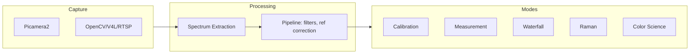

# PySpectrometer3

A modular spectrometer application for Raspberry Pi and desktop. Calibrate, measure spectra, record waterfalls, analyze Raman scattering, and perform color science—all from one codebase.

> **Inspired by** [PySpectrometer2](https://github.com/leswright1977/PySpectrometer) by Les Wright — the project that turned a pocket spectroscope and Pi camera into a serious instrument. This project is a complete rewrite with a new architecture.

*Screenshots coming soon — you can add your own to the `media/` folder.*

---

## Why a Total Rewrite?

PySpectrometer2 proved that a DIY spectrometer could rival commercial units. But OS changes (Bullseye and beyond), broken dependencies, and the limitations of a single monolithic script made evolution difficult. PySpectrometer3 was built from scratch to address:

- **Maintainability** — Modular design, clear separation of capture → extraction → processing → display
- **Extensibility** — Mode-based architecture so new workflows (Raman, Color Science) don’t require rewriting core logic
- **Flexibility** — Pluggable camera backends (Picamera2, OpenCV, V4L, RTSP, HTTP streams)
- **Testability** — Unit-tested extraction, calibration, and peak detection
- **Modern tooling** — Poetry, Ruff, pytest, Python 3.11+

Most of it is vibe coded — built iteratively with a focus on “does it work?” and “can we extend it?” rather than perfect upfront design. The architecture doc (`docs/ARCHITECTURE.md`) captures the resulting structure.

---

## Features

### Operating Modes

| Mode | Purpose |
|------|---------|
| **Calibration** | Wavelength calibration from known spectral lines (FL12, Hg, LED, D65) with auto peak-matching and polynomial fit |
| **Measurement** | General spectrum measurement with dark/white reference, overlay comparison, LED and I2C light control |
| **Waterfall** | Time-resolved spectrum display; stream to CSV with timestamps |
| **Raman** | Raman shift (cm⁻¹) display; laser wavelength config; zero cm⁻¹ auto-detect |
| **Color Science** | XYZ/LAB, CRI, CCT; reflectance/transmittance/illumination; xy chromaticity diagram |

### Spectrum Extraction

- **Auto-level** — Adjust gain to bring peaks into target range
- **Auto-center Y** — Find spectrum center from intensity profile
- **Extraction methods** — Weighted sum (default), median (robust to hot pixels), Gaussian fit (precision)
- **Rotation handling** — Auto-detect and correct tilted spectrum lines (e.g. 5–15°)
- **Perpendicular width** — Configurable sampling width for better S/N

### Calibration

- **4-point minimum** — 3rd order polynomial for accurate wavelength mapping
- **Reference sources** — Fluorescent (FL12), Mercury (Hg), White LED, CIE D65
- **Auto-calibrate** — Match detected peaks to reference lines; save/load calibration

### Processing Pipeline

- **Dark/white correction** — Normalize to references for transmission/reflectance
- **Savitzky–Golay filter** — Smoothing with configurable order
- **Sensitivity correction** — Optional sensor spectral curve (e.g. OV9281)
- **Peak detection** — For calibration, overlays, and mode-specific logic

### Capture

- **Picamera2** — Native Raspberry Pi camera support
- **OpenCV** — Webcam, V4L2, RTSP, HTTP MJPEG (e.g. remote Pi stream)
- **10-bit grayscale** — Pipeline expects 0–1023 for better dynamic range

### Display & Export

- **Graticule** — Wavelength axis, peak labels, measurement cursors
- **Waterfall** — Time vs wavelength intensity
- **Waveshare 3.5"** — Optimized layout for touchscreen
- **Fullscreen** — 800×480 for benchtop setups
- **CSV export** — Spectrum data with metadata

---

## Quick Start

```bash
# Install (desktop)
poetry install

# Run (default: Measurement mode)
poetry run python -m pyspectrometer

# Calibration mode
poetry run python -m pyspectrometer --mode calibration

# Raman with 785 nm laser
poetry run python -m pyspectrometer --mode raman --laser 785

# Use webcam instead of Pi camera
poetry run python -m pyspectrometer --list-cameras   # List devices
poetry run python -m pyspectrometer --camera 0       # Use device 0

# Waveshare 3.5" display (on Pi)
poetry run python -m pyspectrometer --waveshare --mode measurement
```

### Keyboard Shortcuts (common)

| Key | Action |
|-----|--------|
| `q` | Quit |
| `s` | Save spectrum (PNG + CSV) |
| `h` | Toggle peak hold |
| `m` | Toggle measure mode (wavelength cursor) |
| `c` | Calibration (in Calibration mode) |
| `e` | Cycle extraction method |
| `E` | Auto-detect rotation angle |

---

## Project Structure



See `docs/ARCHITECTURE.md` for the full design, mode specs, and implementation status.

---

## Hardware

The original PySpectrometer2 hardware design still applies:

- **Standard build** — Pocket spectroscope + Pi camera + zoom lens (M12)
- **Mini build** — Pocket spectroscope + Pi camera + 12 mm fixed lens
- **Standalone** — Hyperpixel 4" or Waveshare 3.5" for a compact benchtop unit

For a portable spectrometer with OV9281, prism, fiber optics, and Waveshare 3.5" display, see [Building a Portable Visible Light Spectrometer](https://itohi.com/colorimetry/portable-vis-spectrometer/) (ITOHI blog).

Reference: [Les Wright’s PySpectrometer](https://github.com/leswright1977/PySpectrometer) and [YouTube channel](https://www.youtube.com/leslaboratory).

---

## Raspberry Pi Zero 2 W Setup (Waveshare 3.5" + OV9281)

This section covers configuring Raspberry Pi OS **Trixie** (or Bookworm) for the Waveshare 3.5" DPI LCD and OV9281 monochrome camera. The DPI display uses GPIO pins, so we disable auto-detect and load overlays explicitly.

### Prerequisites

- Raspberry Pi Zero 2 W with Raspberry Pi OS Trixie (or Bookworm)
- [Waveshare 3.5" DPI LCD](https://www.waveshare.com/3.5inch-dpi-lcd.htm) (640×480, touch)
- OV9281 monochrome camera module (CSI)

### Quick Setup (Makefile)

From the project root on the Pi, run in order:

```bash
make setup-packages       # System deps + poetry install
make setup-partitions     # Separate writable /home (see below)
make setup-safe-shutdown  # Logs to RAM, root/boot read-only
make setup-display        # Waveshare + OV9281 overlays and config
sudo reboot
```

**Partitions:** Root = used + 4GB (+ 256MB buffer), home = remainder. Boot from USB, run `make setup-partitions` (no GParted—all from command line). No swap (bad for SD wear). Logs use tmpfs (RAM).

### Manual Setup

If you prefer to configure manually or the Makefile fails:

1. **Download overlays** — [3.5inch DPI LCD DTBO](https://files.waveshare.com/wiki/3.5inch%20DPI%20LCD/3.5DPI-dtbo.zip), extract, and copy `.dtbo` files to `/boot/firmware/overlays/`.

2. **Edit config** — Add to `/boot/firmware/config.txt`:

   ```
   camera_auto_detect=0
   display_auto_detect=0
   dtoverlay=vc4-kms-v3d
   dtoverlay=waveshare-35dpi
   dtoverlay=waveshare-touch-35dpi
   max_framebuffers=2
   dtoverlay=ov9281,arducam
   enable_uart=1
   gpio=22=op,dl
   ```

   (`ov9281,arducam` for Arducam modules; use `ov9281` for generic. `gpio=22=op,dl` enables LED control.)

3. **Reboot** — `sudo reboot`

### Display Rotation (Trixie/Bookworm)

Use **Screen Configuration** → Screen → DPI-1 → Orientation to rotate display and touch together. For headless/lite: add `video=DPI-1:640x480M@60,rotate=90` (or 180/270) at the start of `/boot/firmware/cmdline.txt`.

### Safe Shutdown (Read-Only Root)

For portable/field use, configure the Pi to survive unsafe power-off:

- **Logs to RAM** — `/var/log` on tmpfs (no SD writes)
- **Root and boot read-only** — No filesystem corruption on power loss
- **Separate `/home`** — Application files and debugging live on a writable partition

Run `make setup-partitions` first (creates `/home`), then `make setup-safe-shutdown`. Use `rw` to remount for system updates, `ro` when done.

### References

- [Waveshare 3.5" DPI LCD Wiki](https://www.waveshare.com/wiki/3.5inch_DPI_LCD) — Full setup, rotation, touch calibration
- [Portable Spectrometer Build](https://itohi.com/colorimetry/portable-vis-spectrometer/) — Hardware design, prism vs grating, OV9281

---

## Dependencies

- Python ≥ 3.11
- NumPy, OpenCV, SciPy, colour-science
- Picamera2 (Raspberry Pi only)

```bash
# Raspberry Pi system deps
sudo apt-get install python3-opencv python3-numpy libcamera-dev python3-picamera2
```

---

## License

Open Source. See [LICENSE](LICENSE) for details.

If you find value in projects like this, consider supporting the original author: [PayPal — Les Wright](https://paypal.me/leslaboratory?locale.x=en_GB).
