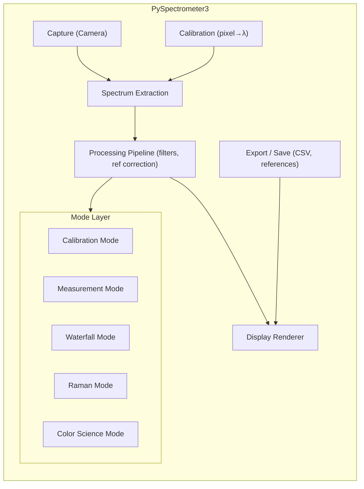
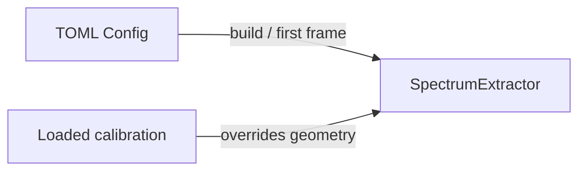

# PySpectrometer3 — Application Architecture

**Status:** This document is the **primary** map of the application: modes, data flow, extraction, configuration, CLI, and module layout. **Authoritative for behavior** are the **source modules** (e.g. `modes/*/get_buttons()`, `spectrometer.py`, `display/renderer.py`). Refactor specs and UI/trace design live in companion docs below—not duplicated here in full.

**Companion documents**

| Document | Contents |
|----------|----------|
| [CONFIGURATION_ARCHITECTURE.md](CONFIGURATION_ARCHITECTURE.md) | TOML config, `DisplayRuntimeView`, calibration vs extraction overlap |
| [DISPLAY_GUI_ARCHITECTURE.md](DISPLAY_GUI_ARCHITECTURE.md) | Display/GUI composition, `DisplayManager`, refactor targets |
| [SPECTRUM_TRACE_MODEL.md](SPECTRUM_TRACE_MODEL.md) | Unified traces, markers, overlays, metadata, allocation notes |
| [REFACTORING_GUIDE.md](REFACTORING_GUIDE.md) | SRP tasks, callback wiring, incremental refactors |

---

## 1. Overview

PySpectrometer3 is software that runs on a Raspberry Pi. A camera looks through a prism onto a slit. This produces a vertical slit smeared across the camera sensor depending on wavelength. There is slight structure to the vertical stripes due to the way light is coupled to the slit.

The application has **five runtime modes** selectable via CLI (`--mode`): **calibration**, **measurement**, **waterfall**, **raman**, **colorscience**. They share an **acquisition and processing stack** and mode-specific **controls and workflows**. All use the same camera, spectrum extraction, and core pipeline.

**Runtime vs `ModeType` enum** (`modes/base.py`): The enum lists **Calibration**, **Measurement**, **Raman**, **Color Science**. **Waterfall** is a separate CLI mode but reuses `ModeType.MEASUREMENT` (class `WaterfallMode` subclasses `MeasurementMode`). Prefer `Spectrometer.VALID_MODES` and `spectrometer.mode` string for dispatch.

### 1.1 Spectrum Alignment (Auto-level)

The slit may be rotated slightly. We point the spectrometer at a light source with clear spectrum peaks, which produces several vertical lines. We find these lines by mapping ellipses to the stripes, then determine the center. Using the rotation angle and offset, we rotate the image in the opposite direction to straighten the spectrum image and crop it so the spectrum is centered.

### 1.2 Calibration

We use light sources (FL12, HG, LED, D65) with known spectrum and peaks. We capture a spectrum and map it to the known spectrum. We fit a polynomial according to Snell's law to capture the dispersion nature of the spectrum. We fit to the known spectrum and use the polynomial to calculate wavelengths for all pixels, not just where the spectrum matches.

### 1.3 Sensitivity Correction

We use the CMOS sensitivity curve for OV9281 (or the next best candidate) to correct sensitivity roughly. Sensor spectral curves for OV9281, OV7251, IMX290, IMX296, and other MIPI sensors are documented in the [VC MIPI Camera Module Hardware Manual](https://www.mipi-modules.com/fileadmin/external/documentation/hardware/VC_MIPI_Camera_Module/index.html); spectral curve charts are available as reference data (see `data/sensor_sensitivity/`). We also support a known reference spectrum (e.g. halogen light bulb at a specific color temperature, with or without UV filter): measure that spectrum and derive the sensitivity correction curve from the deviation. Calibration and sensitivity correction can be saved and loaded as a configuration file for use in other modes.

### 1.4 Light Source Control

Modes such as Measurement, Waterfall, and Color Science can turn on/off an LED connected to GPIO 22. They can also control a GPIO expander on the I2C bus to switch various other light sources. Raman mode always uses an externally controlled laser source.

---

## 2. High-Level Architecture



**Data flow (simplified):**

1. **Frame** from camera → **SpectrumExtractor** → **(cropped image, intensity array)**
2. **Intensity** + **Calibration** → **SpectrumData** (wavelength, intensity)
3. **SpectrumData** → **ProcessingPipeline** (filters, dark/white correction, etc.) → **SpectrumData**
4. **Mode** consumes processed spectrum for overlays, references, and mode-specific logic
5. **Display** renders spectrum + mode overlays; **Export** saves on user action

### 2.1 Config defaults vs loaded calibration

The aggregate TOML `Config` holds **defaults** used to build the initial pipeline (e.g. `ExtractorBuildParams.from_config`). Some fields overlap conceptually with **calibration** (rotation angle, spectrum strip center, perpendicular width): they appear under `ExtractionConfig` for first-run behavior and are **also** stored in the loaded **calibration** artifact when you save wavelength calibration.

**Rule:** after a calibration is loaded, **`Spectrometer` applies geometry from the `Calibration` object** to `SpectrumExtractor` (not from `config.extraction` alone). Editing overlapping keys in TOML affects **startup before load** and **next extraction build**; the running strip follows the **last loaded calibration** until you reload config or change calibration.

Reference CSV discovery uses **`config.export.reference_dirs`** resolved through `ReferenceSearchPaths` and **`ReferenceFileLoader`** — not global mutable path state.



---

## 3. Operating Modes

### 3.1 Summary

| Mode            | Implementation | Purpose                              | Key differentiators                                              |
|-----------------|----------------|--------------------------------------|-------------------------------------------------------------------|
| **Calibration** | Done           | Wavelength calibration from lines    | Many reference sources, auto-calibration, optional **manual assist** (markers on measured + reference SPD), sensitivity overlay |
| **Measurement** | Done           | Spectrum measurement with light control | LED, I2C expander; black/white ref; save/load; optional waterfall window alongside spectrograph |
| **Waterfall**   | Done           | Time-resolved / monitoring           | `--mode waterfall`: waterfall-first UI, REC/stream CSV, snapshot export (`modes/waterfall.py`) |
| **Raman**       | MVP            | Raman scattering spectroscopy      | Laser nm → cm⁻¹ axis, dark ref, save/load (`modes/raman.py`); bond/compound library = future |
| **Color Science** | MVP          | Colorimetry + spectrum               | XYZ/LAB, swatches, xy diagram, CRI/CCT paths (`modes/colorscience.py`, `colorscience/`) |

**Common controls (all modes except Calibration):**

| Control       | Description |
|---------------|-------------|
| Save Spectrum | Save current spectrum to CSV |
| Load Spectrum | Load saved spectrum as reference |
| Average       | Toggle averaging mode (accumulate frames) |
| Set Black     | Capture dark/black reference |
| Set White     | Capture white reference (100% baseline) |
| Gain +/-      | Manual gain adjustment |
| Auto Gain     | Automatic gain control |
| Exposure +/-  | Manual exposure adjustment (if camera supports) |
| Auto Exposure | Automatic exposure control |
| Lamp On/Off   | GPIO 22 light control |

Mode selection: **startup** via `--mode` (CLI). Each mode is a **BaseMode** subclass with: `mode_type`, `name`, `get_buttons()`, `handle_action()`, `get_overlay()`, `update_display()`, `process_spectrum()`, and optional `transform_spectrum_data()` / `get_graticule()`.

### 3.1.1 Common controls unification target (behavior-preserving)

The following control families are **shared UX** and should be defined once, reused by all applicable modes, and handled by shared callbacks in `BaseMode`/common controllers:

- Record/capture family (`Rec`/`Save`/`Load`)
- Integration family (`AVG`/`MAX`/`ACC`)
- Zoom and graph controls (`ZX`, `ZY`, peaks, bars)
- Reference controls (`Dark`, `White`, clear refs)
- Lamp/illumination controls (`Lamp`, LED slider, I2C where applicable)
- Camera controls (`Gain`, `AutoGain`, `Exposure`, `AutoExposure`)
- App/session controls (`Quit`, preview cycle)

**Constraint:** unify **without behavior change**. Keep mode-specific controls additive (e.g., calibration sources, Raman laser actions, color-science swatches) while common controls come from a shared profile/composer. Avoid per-mode copy/paste button/callback code paths.

---

### 3.2 Mode 1: Calibration

**Purpose:** Map pixels to wavelength using reference SPDs (library and/or CSV), polynomial fit, and optional **manual calibration assist** (user-placed markers on measured and reference curves when auto-calibration is unreliable).

**Authoritative UI:** Button labels, rows, `action_name`s, and icons are defined in **`modes/calibration.py`** → `get_buttons()`. Do not duplicate long button tables in this doc; update the code when the bar changes.

**Reference sources:** Multiple toggles (Hg, D65, A, FL1–FL3, FL12, LED1–LED3, …) select `ReferenceSource` data via `data/reference_spectra.py` and optional CSV loaders (`ReferenceFileLoader`, `reference_dirs` in config).

**Assist:** `MkrM` / `MkrR`-style placement uses `DisplayState.marker_lines` and `reference_marker_lines` with `calibration_assist_target`; snap peaks can be supplied for the reference SPD when assist-reference is active. **Planned simplification:** unified marker model — see [SPECTRUM_TRACE_MODEL.md](SPECTRUM_TRACE_MODEL.md).

**Algorithms (where to look):** Auto-level / auto-calibration / correlation matching live under `processing/auto_calibrator.py`, `processing/peak_detection.py`, and `modes/calibration.py`. **Rule of thumb:** prefer **≥4** matched points for a robust wavelength fit (exact polynomial order follows implementation).

**Typical workflow:** Select source → align spectrum (LVL, freeze, overlay) → **CAL** (auto) or manual markers → verify → **SaveCal**.

---

### 3.3 Mode 2: Measurement

**Purpose:** General spectrum measurement with reference normalization and light source control.

**Features:**

- **Light sources:** Turn LED (GPIO 22) on/off; turn I2C expander pins on/off.
- **References:** Set black level; set white level (e.g. for transmission spectrum).
- **Spectrum:** Save spectrum; load spectrum as overlay, black reference, or white reference.

**Processing pipeline:**  
`Raw Frame → Dark Subtraction → White Normalization → Display`  
- Black: applied when set (dark reference).  
- White: applied when set (e.g. 100% transmission baseline).  
- `Normalized = (Raw - Black) / (White - Black)`

**Load options:** Loaded spectrum can be used as overlay (for comparison), as black reference, or as white reference.

**GUI controls (Measurement):**

| Row | Controls |
|-----|----------|
| 1   | [Save] [Load] [Capture] [ClrRef] │ [Avg] [Dark] [White] │ Load as: Overlay/Black/White |
| 2   | [ShowRef] [Norm] │ [AutoG] [Gain+] [Gain-] │ [LED] [I2C…] │ Gain: 25 │ Avg: 1 |

**Button mapping:**

| Button  | Action           | Description |
|---------|------------------|-------------|
| Capture | capture          | Capture current spectrum as reference |
| Peak    | capture_peak     | Peak hold mode |
| Avg     | toggle_averaging | Toggle spectrum averaging |
| Dark    | set_dark         | Set black reference |
| White   | set_white        | Set white reference |
| ClrRef  | clear_refs       | Clear all references |
| Save    | save             | Save spectrum to file |
| Load    | load             | Load spectrum (select use: overlay, black, or white) |
| ShowRef | show_reference   | Toggle reference overlay |
| Norm    | normalize        | Toggle normalization to reference |
| LED     | led_toggle       | Toggle GPIO 22 LED |
| I2C…    | i2c_expander     | Control I2C GPIO expander pins |
| AutoG   | auto_gain        | Toggle automatic gain control |
| Gain+/- | gain_up/down     | Manual gain adjustment |
| Quit    | quit             | Exit application |

---

### 3.4 Mode 3: Waterfall (implemented)

**Purpose:** Measurement-class processing with **waterfall-first** UI (`WaterfallMode` in `modes/waterfall.py`). `--mode waterfall` enables `config.waterfall.enabled` and uses a dedicated window layout in `DisplayManager` when `mode == "waterfall"`.

**Features:** CSV export / REC streaming with timestamps, waterfall snapshot save, shared measurement controls (see `MeasurementMode` superclass). Optional stepper/angle logging remains future work if not wired in code.

---

### 3.5 Mode 4: Raman (MVP implemented)

**Purpose:** Measure Raman scattering. The mode must know the laser wavelength; it may detect the laser line in the actual spectrum to establish zero cm⁻¹, then recalculate the spectrum in Raman shift (cm⁻¹). Future: bond detection (C–C, C=C, etc.) and compound matching.

**Configuration (e.g. ini):**

```ini
[raman]
laser_wavelength_nm = 785.0
laser_detection_range_nm = 5.0
wavenumber_range_min = 200
wavenumber_range_max = 3200
```

**Features:**

- **Laser wavelength:** Must be known (config or user input). Used for wavelength → Raman shift conversion.
- **Zero cm⁻¹:** Optionally detect the laser line in the spectrum to set the Raman zero (0 cm⁻¹) automatically.
- **Raman spectrum:** Recalculate spectrum from wavelength to Raman shift (cm⁻¹) and display.
- **Light source:** Raman uses an externally controlled laser; no built-in LED for sample illumination in this mode.
- **Future:** Detect characteristic bond peaks (C–C, C=C, etc.); compound matching against a library.

**Wavenumber calculation:**

```python
def wavelength_to_wavenumber(
    wavelength_nm: float,
    laser_nm: float = 785.0,
) -> float:
    """Convert wavelength to Raman shift in cm⁻¹."""
    return (1.0 / laser_nm - 1.0 / wavelength_nm) * 1e7
```

**GUI controls (Raman):**

| Row | Controls |
|-----|----------|
| 1   | [Save] [Load] [Set Ref] │ [Average] [Black] │ Laser: 785 nm │ [Find Laser] |
| 2   | [Gain+] [Gain-] [AutoG] │ Shift: 0–3200 cm⁻¹ |

**Raman baseline correction (open):** Options — polynomial fit, airPLS. Recommendation: start with polynomial, add airPLS later.

---

### 3.6 Mode 5: Color Science (MVP implemented)

**Purpose:** Colorimetric analysis in addition to spectrum. Calculates light color (XYZ, LAB) for reflection, transmission, or illumination. Allows measuring and comparing colors via a swatch grid.

**Measurement types (selectable):**

| Type         | Description                    | Requirements |
|--------------|--------------------------------|--------------|
| Reflectance  | Light reflected from sample    | Black and white point stored |
| Transmittance| Light passing through sample   | Black and white point stored |
| Illumination | Light source characterization  | Black point only |

**Layout:**

1. **Control buttons** (top)
2. **Crop preview** (camera view, spectrum region)
3. **Spectrum** (reduced height)
4. **Color swatches** — grid of rectangles:
   - Leftmost: current color with XYZ or LAB values (selectable display)
   - Remaining: measured color swatches in a grid

**Color swatches:**

- Add or delete swatches; form a grid of measured colors.
- Select two swatches to compare their delta (ΔE) and view XYZ/LAB values.
- Each swatch stores: spectrum, XYZ/LAB values, measurement type (reflectance/transmittance/illumination).
- Reflectance and transmittance swatches require black and white point stored with the swatch.
- Save swatches with spectrums as CSV: each swatch → spectrum + XYZ/LAB + metadata, for later analysis.

**xy diagram:**

- Display CIE xy chromaticity diagram.
- Show black point, white point, and current color as points as seen by the spectrometer.

**Reference data required:**  
D65 Daylight (CIE Standard Illuminant D65); CIE 1931 2° Observer (x̄, ȳ, z̄); CIE 1964 10° Observer (x̄₁₀, ȳ₁₀, z̄₁₀); Test Color Samples (TCS) for CRI.

**Tristimulus (XYZ):**

```python
def calculate_XYZ(
    spectrum: np.ndarray,
    wavelengths: np.ndarray,
    observer: str = "10deg",  # "2deg" or "10deg"
) -> tuple[float, float, float]:
    # X = k * Σ S(λ) * x̄(λ) * Δλ
    # Y = k * Σ S(λ) * ȳ(λ) * Δλ
    # Z = k * Σ S(λ) * z̄(λ) * Δλ
    # k = 100 / Σ S_ref(λ) * ȳ(λ) * Δλ
```

**CRI (Color Rendering Index), CIE 13.3 (illumination mode):**  
1. u, v chromaticity of test source → 2. CCT → 3. Reference illuminant (Planckian or D) → 4. Color shift for 8 (or 14) TCS → 5. Ra = average of R1–R8.

**GUI controls (Color Science):**

| Row | Controls |
|-----|----------|
| 1   | [Refl] [Trans] [Illum] │ [Add Swatch] [Del Swatch] [Compare] │ [LED] [I2C…] │ XYZ/LAB |
| 2   | [Black] [White] │ [Save] [Load] │ xy diagram │ CRI: -- │ CCT: -- K |

---

## 4. Spectrum Extraction

**Status: Implemented.** Handles rotated spectrum lines (e.g. 5–15°), vertical structure from coupling, and wide dynamic range.

**Module:** `pyspectrometer/processing/extraction.py`

**SpectrumExtractor:**

- Attributes: `rotation_angle` (degrees, from calibration), `perpendicular_width` (pixels), `method` (ExtractionMethod), `background_threshold` (optional).
- Methods: `extract(frame) -> (cropped, intensity)`, `detect_angle(frame) -> float` (auto-detect via Hough), `set_method(method)`.

**Extraction methods:**

| Method        | Description | Pros | Best for |
|---------------|-------------|------|----------|
| **Weighted sum** (default) | Per x along rotated spectrum: sample perpendicular, intensity-weighted sum `sum(I*I)/sum(I)` or sum; normalize to range | Best S/N, captures all light | General, low–medium signal |
| **Median**     | Per x: sample perpendicular, take median | Robust to hot pixels, cosmic rays | Noisy, high signal |
| **Gaussian**   | Per x: sample perpendicular, fit 1D Gaussian `A*exp(-(x-μ)²/(2σ²))+B`; use amplitude A (or area A*σ*√(2π)) | Most accurate, separates signal from background | Precision, publication |

**Angle detection (calibration):**  
1. Frame → grayscale → 2. Canny edge detection → 3. Probabilistic Hough transform → 4. Filter lines by length/position (center) → 5. Dominant angle from lines → 6. Store in calibration.

**ExtractionConfig (config.py):**

```python
@dataclass
class ExtractionConfig:
    method: str = "weighted_sum"          # "median", "weighted_sum", "gaussian"
    rotation_angle: float = 0.0           # degrees, from calibration
    perpendicular_width: int = 20         # pixels perpendicular to axis
    background_percentile: float = 10.0  # background subtraction
    gaussian_sigma_init: float = 3.0      # initial sigma for Gaussian fit
```

**Calibration file format (extended):**

```
pixels: 100,300,500,700
wavelengths: 400.0,500.0,600.0,700.0
rotation_angle: 7.5
spectrum_y_center: 240
perpendicular_width: 25
```

**Keyboard (extraction):**

| Key   | Action |
|-------|--------|
| `e`   | Cycle extraction method (median → weighted_sum → gaussian) |
| `E` (Shift+e) | Auto-detect rotation angle |
| `[`   | Decrease perpendicular width |
| `]`   | Increase perpendicular width |

**Performance:**  
Median O(n log n)/column; weighted sum O(n)/column (fastest); Gaussian O(iterations×n)/column (slowest). Real-time target 30 fps @ 800 px: median/weighted &lt; 1 ms; Gaussian ~10–50 ms (every N frames or background). Gaussian optimization: use previous fit as initial guess, limit maxfev=100, pre-allocate, optionally fit subset of columns and interpolate.

**Testing:**  
Synthetic cases: horizontal (0°), rotated (10°), hot pixels, low signal, saturated. Validate: compare to reference, S/N vs row average, profile per method.

---

## 5. Layer Details

### 5.1 Capture

- **CameraInterface:** abstract API (width, height, gain, start, stop, capture). All backends return frames in the format the pipeline expects (see below).
- **picamera.Capture:** Picamera2 implementation for Raspberry Pi cameras.  
  Output: raw 2D frames; extraction uses calibration geometry.
- **opencv.Capture:** OpenCV VideoCapture for webcam, V4L, RTSP, or HTTP MJPEG.  
  Selected via CLI `--camera SOURCE`; substitutes default with no other code changes.  
  - **List cameras:** `--list-cameras` enumerates available devices (e.g. on Windows: index + name; Linux: /dev/video*).
  - **Capabilities on start:** On `start()`, log camera info and capabilities (resolution, fps, format) similar to Picamera2.
  - **Gain / exposure:** No-op; setters accept values but have no effect (many webcam/RTSP sources do not support them).

**Pipeline frame contract:** Capture backends must output **10-bit grayscale** frames: 2D `uint16` array, shape `(height, width)`, values 0–1023. Picamera provides this natively in monochrome mode; opencv.Capture must convert BGR/grayscale to this format (e.g. `gray.astype(np.uint16) * 1023 / 255`).

**CLI camera selection:**

| Parameter | Values | Backend | Example |
|-----------|--------|---------|---------|
| (default) | — | picamera.Capture | Pi camera |
| `--list-cameras` | flag | — | Enumerate available cameras (OpenCV backend); exit after listing |
| `--camera 0` | int (device index) | opencv.Capture | Webcam /dev/video0 |
| `--camera v4l:/dev/video2` | v4l:path | opencv.Capture | V4L2 device |
| `--camera rtsp://host/stream` | rtsp://... | opencv.Capture | RTSP stream |
| `--camera http://host:8000/stream.mjpg` | http://... | opencv.Capture | HTTP MJPEG (e.g. Pi stream) |

When `--camera` is set, `__main__` constructs `opencv.Capture(source=..., ...)` and passes it to `Spectrometer(camera=...)`. No other code changes; the rest of the app uses only `CameraInterface`.

### 5.2 Calibration

- **Calibration:** pixel ↔ wavelength (polynomial, 4-point min), load/save.  
- **Calibration file:** pixels, wavelengths; optionally rotation_angle, spectrum_y_center, perpendicular_width.  
Used by SpectrumExtractor (geometry), Spectrometer (SpectrumData wavelength axis), Calibration mode (recalibrate, save, load).

### 5.3 Processing Pipeline

**ProcessingPipeline** chains **ProcessorInterface**: each takes and returns **SpectrumData**. Typical order: (1) reference correction (dark/white), (2) smoothing (e.g. Savitzky–Golay), (3) mode-specific (e.g. Raman wavenumber, Color Science normalization). Modes can enable/disable or add processors.

### 5.4 Mode Layer

- **BaseMode:** `ModeState`, `get_buttons()`, `handle_action()`, `get_overlay()`, **`update_display(ctx, processed, graph_height)`** (primary hook for overlays and status), `process_spectrum()`, optional `transform_spectrum_data()` / `get_graticule()`.
- **CalibrationMode, MeasurementMode, WaterfallMode, RamanMode, ColorScienceMode:** implemented in `modes/`. Waterfall subclasses Measurement.

### 5.5 Display and Export

- **DisplayManager** (`display/renderer.py`): OpenCV windows, graph stack, control bar, sliders, markers, waterfall branch; modes update it via **`update_display`** on `ModeContext`.
- **Export:** `export/csv_exporter.py`, `export/graph_export.py` (matplotlib PDF paths); metadata builders in CSV exporter for markers, sensitivity, waterfall bundles.

---

## 6. Data Flow by Mode

- **Calibration:** Frame → SpectrumExtractor → intensity → Calibration (poly) → wavelength → (optional) pipeline → Display (spectrum + reference overlay). User: Freeze → AutoCal → SaveCal.
- **Measurement:** Frame → SpectrumExtractor → intensity → Calibration → SpectrumData → pipeline (dark/white, filter) → Display. User: Capture, Norm, Save/Load, LED, I2C.
- **Waterfall:** Measurement pipeline + `WaterfallMode` UI; waterfall buffer + optional second window; CSV REC / snapshot export; stepper logging TBD.
- **Raman:** `transform_spectrum_data` / wavenumber graticule; dark ref; Save/Load. Future: bond peaks, compound matching.
- **Color Science:** XYZ/LAB, swatches, xy diagram, CRI/CCT paths; multi-view preview (`cycle_preview`). Ongoing: fuller CRI/TCS.

---

## 7. Data Files Required

**Calibration references:**

```
data/references/
├── FL12_spectrum.csv
├── HG_low_pressure.csv
├── LED_spectrum.csv
├── D65_spectrum.csv
└── reference_lines.json
```

**Color science:**

```
data/colorscience/
├── CIE_D65_1nm.csv
├── CIE_xyz_1931_2deg_1nm.csv
├── CIE_xyz_1964_10deg_1nm.csv
├── CIE_TCS_reflectance.csv
└── planckian_locus.csv
```

**Sensor spectral sensitivity (for sensitivity correction):**

Reference: [VC MIPI Camera Module Hardware Manual](https://www.mipi-modules.com/fileadmin/external/documentation/hardware/VC_MIPI_Camera_Module/index.html) — spectral curves for OV9281, OV7251, IMX290, IMX296, and other sensors.

```
data/sensor_sensitivity/
├── mipi_sensors_spectral_curve.png   # Source chart from VC documentation
├── OV9281_spectral_sensitivity.csv   # Curated OV9281 curve (wavelength_nm, relative_sensitivity)
└── OV9281_spectral_sensitivity_extracted.csv  # Programmatic extraction (scripts/extract_sensor_curve.py)
```

Use `OV9281_spectral_sensitivity.csv` for sensitivity correction; the extracted CSV is experimental. Run `python scripts/extract_sensor_curve.py [image] -o output.csv` to re-extract from the chart image.

---

## 8. Module Map

```
src/pyspectrometer/
├── __main__.py              # CLI: --mode, --camera, --window, --waterfall, etc.
├── cli.py                   # argparse helpers used by __main__
├── config.py                # Config, DisplayConfig, DisplayRuntimeView, ExtractionConfig
├── bootstrap.py             # build_spectrometer_components, ReferenceFileLoader wiring
├── spectrometer.py          # Orchestrator: camera, extractor, pipeline, mode, display, export, keyboard
├── capture/
│   ├── base.py              # CameraInterface
│   ├── picamera.py          # Picamera2 backend
│   └── opencv.py            # Webcam / V4L / RTSP / HTTP MJPEG
├── processing/
│   ├── base.py              # ProcessorInterface
│   ├── extraction.py        # SpectrumExtractor
│   ├── extractor_params.py  # ExtractorBuildParams, build_spectrum_extractor
│   ├── pipeline.py          # ProcessingPipeline
│   ├── reference_correction.py
│   ├── filters.py           # SavitzkyGolay, etc.
│   ├── auto_controls.py     # AutoGainController, AutoExposureController
│   ├── auto_calibrator.py   # Wavelength calibration optimization
│   ├── peak_detection.py
│   ├── spectrum_transform.py
│   ├── raman.py             # wavelength → wavenumber helpers
│   ├── sensitivity_correction.py
│   ├── sensitivity_curve_fit.py
│   ├── sensor_units.py
│   └── calibration/         # hough_matching, cauchy_fit, detect_peaks, extremum
├── core/
│   ├── calibration.py       # Calibration, load/save
│   ├── calibration_io.py
│   ├── spectrum.py          # SpectrumData, Peak
│   ├── spectrum_overlay.py
│   ├── reference_spectrum.py
│   └── mode_context.py      # ModeContext (display, camera, ctx hooks)
├── modes/
│   ├── base.py
│   ├── calibration.py
│   ├── measurement.py
│   ├── waterfall.py
│   ├── raman.py
│   └── colorscience.py
├── data/
│   ├── reference_spectra.py
│   ├── reference_loader.py
│   └── reference_paths.py
├── display/
│   ├── renderer.py          # DisplayManager
│   ├── graticule.py, spectrum.py, peaks.py, markers.py, viewport.py
│   ├── waterfall.py, overlay_utils.py, calibration_preview.py
│   └── ...
├── gui/
│   ├── control_bar.py, buttons.py, sliders.py, icons.py
├── input/
│   └── keyboard.py
├── export/
│   ├── csv_exporter.py
│   └── graph_export.py      # matplotlib PDF
├── colorscience/            # xyz, chromaticity, swatches, illumination_metrics, ...
├── hardware/
│   └── led.py
├── csv_viewer/              # Optional CSV viewer mode (separate entry)
└── utils/
    ├── display.py, graph_scale.py, dialog.py, ...
```

Feature logic is spread across `modes/`, `processing/`, and `display/` as above; prefer **one** reference-correction path (`reference_correction.py`) for dark/white.

---

## 9. Command Line Interface

```bash
# Launch by mode
python -m pyspectrometer --mode calibration
python -m pyspectrometer --mode measurement
python -m pyspectrometer --mode waterfall
python -m pyspectrometer --mode raman
python -m pyspectrometer --mode colorscience

# Camera source (OpenCV backend; default = Picamera)
python -m pyspectrometer --list-cameras                # List available cameras; exit
python -m pyspectrometer --camera 0                    # Webcam /dev/video0
python -m pyspectrometer --camera v4l:/dev/video2      # V4L2 device
python -m pyspectrometer --camera rtsp://host/stream   # RTSP stream

# Other options
python -m pyspectrometer --mode colorscience --submode transmittance
python -m pyspectrometer --mode raman --laser 785
python -m pyspectrometer --waveshare --mode measurement
```

---

## 10. Desktop Links (make install-link)

**Install:** `make install-link`

Creates desktop entries in `~/.local/share/applications/`:

| Link                     | Command                              | Description      |
|--------------------------|--------------------------------------|------------------|
| pyspec-calibration.desktop   | `--waveshare --mode calibration`   | Calibration Mode |
| pyspec-measurement.desktop   | `--waveshare --mode measurement`   | Measurement Mode |
| pyspec-waterfall.desktop     | `--waveshare --mode waterfall`     | Waterfall Mode   |
| pyspec-raman.desktop         | `--waveshare --mode raman`         | Raman Mode       |
| pyspec-colorscience.desktop  | `--waveshare --mode colorscience`  | Color Science    |
| pyspec.desktop               | `--waveshare`                      | Default (Measurement) |

**Desktop entry template:**

```ini
[Desktop Entry]
Name=PySpectrometer - Measurement
Comment=Spectrum Measurement Mode
Exec=/home/pi/PySpectrometer3/venv/bin/python -m pyspectrometer --waveshare --mode measurement
Icon=/home/pi/PySpectrometer3/assets/icon.png
Terminal=false
Type=Application
Categories=Science;Education;
```

**Shell scripts** in `/usr/local/bin/` (example):

```bash
#!/bin/bash
# /usr/local/bin/pyspec-measurement
cd /home/pi/PySpectrometer3
./venv/bin/python -m pyspectrometer --waveshare --mode measurement
```

---

## 11. Implementation Phases (historical roadmap)

Phases 1–5 and **OpenCV capture** are **done** in tree. **Waterfall**, **Raman**, and **Color Science** exist as **implemented MVPs** (ongoing feature work, not empty stubs). Remaining product work: optional stepper logging, Raman library matching, fuller CRI/TCS paths, runtime mode switching without restart, and refactors in [REFACTORING_GUIDE.md](REFACTORING_GUIDE.md).

---

## 12. Implementation Status (snapshot)

| Area | Status |
|------|--------|
| Calibration | Done — assist markers, many sources, auto-cal, sensitivity UI |
| Measurement | Done |
| Waterfall | Done — `WaterfallMode`, CSV/REC, dedicated display branch |
| Raman | MVP — `modes/raman.py`, wavenumber axis, dark ref |
| Color Science | MVP — `modes/colorscience.py`, `colorscience/*`, swatches, xy |
| Spectrum extraction | Done — `processing/extraction.py`, keyboard e/E/[/] |
| OpenCV capture | Done — `capture/opencv.py`, `--camera`, `--list-cameras` |
| Matplotlib PDF export | Done — `export/graph_export.py` |

---

## 13. Open Questions

1. **Exposure:** Picamera2 vs OpenCV backends — feature parity for shutter control.  
2. **CRI:** Scope of TCS set (R1–R8 vs R1–R14) for MVP vs full.  
3. **Raman baseline:** Polynomial vs airPLS for fluorescence background.  
4. **Mode switch at runtime:** GUI/keyboard to change mode without process restart.  
5. **Unified trace model:** Reduce duplicate marker/overlay/metadata paths — see [SPECTRUM_TRACE_MODEL.md](SPECTRUM_TRACE_MODEL.md).

---

## 14. Desired architecture evolution (summary)

**Current:** `Spectrometer` orchestrates camera → extractor → pipeline → `BaseMode`; `DisplayManager` centralizes OpenCV UI, markers, and overlays; reference data appears as `SpectrumData` plus ad-hoc `DisplayState` fields for overlays.

**Desired:** Thinner display composition (`DisplayPort`, frame composer), **unified spectrum trace** + metadata for export ([SPECTRUM_TRACE_MODEL.md](SPECTRUM_TRACE_MODEL.md)), **marker controller** for assist, fewer per-frame allocations ([DISPLAY_GUI_ARCHITECTURE.md](DISPLAY_GUI_ARCHITECTURE.md)), optional **callback registry** ([REFACTORING_GUIDE.md](REFACTORING_GUIDE.md)).

**Migration:** Incremental, behavior-preserving phases in those docs; update this file when major boundaries move.

---

This document remains the **primary** architecture map for PySpectrometer3. Deprecated per-mode specs (e.g. MODES_SPEC.md) should point here or be removed if obsolete.
