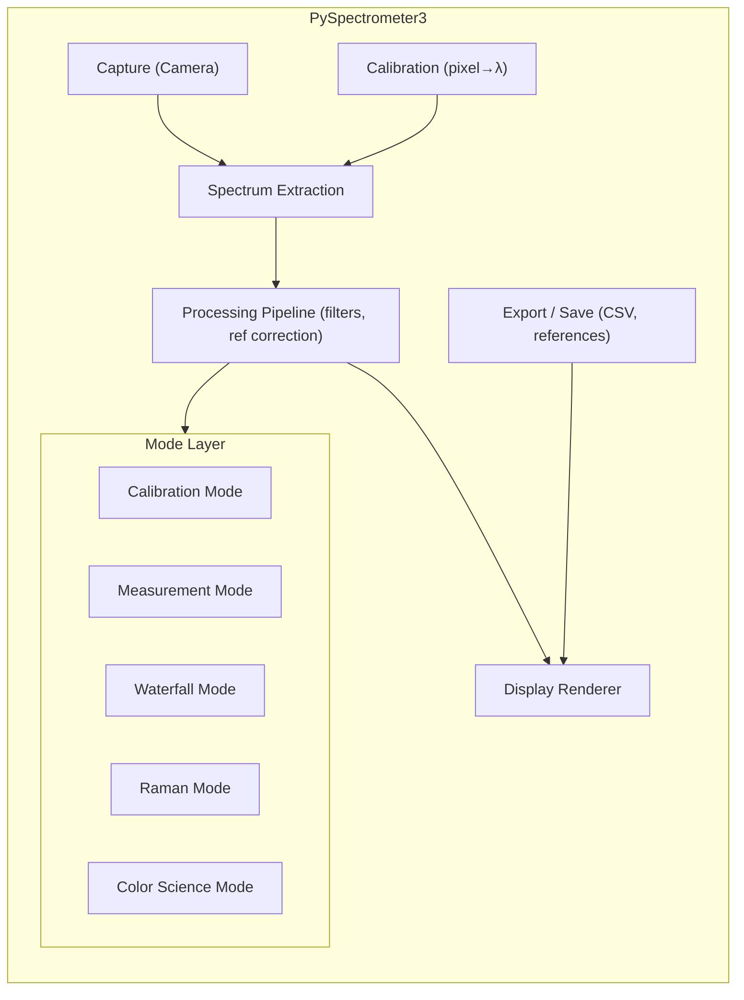

# PySpectrometer3 — Application Architecture

**Status: Single source of truth.** All mode behavior, spectrum extraction, CLI, data files, and implementation status are defined in this document.

---

## 1. Overview

PySpectrometer3 is software that runs on a Raspberry Pi. A camera looks through a prism onto a slit. This produces a vertical slit smeared across the camera sensor depending on wavelength. There is slight structure to the vertical stripes due to the way light is coupled to the slit.

The application has **five operating modes** (Calibration, Measurement, Waterfall, Raman, Color Science), a shared **acquisition and processing stack**, and mode-specific **controls and workflows**. All modes use the same camera, spectrum extraction, and core pipeline.

### 1.1 Spectrum Alignment (Auto-level)

The slit may be rotated slightly. We point the spectrometer at a light source with clear spectrum peaks, which produces several vertical lines. We find these lines by mapping ellipses to the stripes, then determine the center. Using the rotation angle and offset, we rotate the image in the opposite direction to straighten the spectrum image and crop it so the spectrum is centered.

### 1.2 Calibration

We use light sources (FL12, HG, LED, D65) with known spectrum and peaks. We capture a spectrum and map it to the known spectrum. We fit a polynomial according to Snell's law to capture the dispersion nature of the spectrum. We fit to the known spectrum and use the polynomial to calculate wavelengths for all pixels, not just where the spectrum matches.

### 1.3 Sensitivity Correction

We use the CMOS sensitivity curve for OV9281 (or the next best candidate) to correct sensitivity roughly. We also support a known reference spectrum (e.g. halogen light bulb at a specific color temperature, with or without UV filter): measure that spectrum and derive the sensitivity correction curve from the deviation. Calibration and sensitivity correction can be saved and loaded as a configuration file for use in other modes.

### 1.4 Light Source Control

Modes such as Measurement, Waterfall, and Color Science can turn on/off an LED connected to GPIO 22. They can also control a GPIO expander on the I2C bus to switch various other light sources. Raman mode always uses an externally controlled laser source.

---

## 2. High-Level Architecture



**Data flow (simplified):**

1. **Frame** from camera → **SpectrumExtractor** → **(cropped image, intensity array)**
2. **Intensity** + **Calibration** → **SpectrumData** (wavelength, intensity)
3. **SpectrumData** → **ProcessingPipeline** (filters, dark/white correction, etc.) → **SpectrumData**
4. **Mode** consumes processed spectrum for overlays, references, and mode-specific logic
5. **Display** renders spectrum + mode overlays; **Export** saves on user action

---

## 3. Operating Modes

### 3.1 Summary

| Mode            | Purpose                              | Key differentiators                                              |
|-----------------|--------------------------------------|-------------------------------------------------------------------|
| **Calibration** | Wavelength calibration from lines    | Reference sources (FL12, HG, LED, D65), peak matching, 4-point fit |
| **Measurement** | Spectrum measurement with light control | LED, I2C expander; black/white ref; save/load (overlay, black, white) |
| **Waterfall**   | Time-resolved spectrum, change detection | Smaller spectrum window; waterfall display; stream to CSV (timestamp column); optional stepper + angle |
| **Raman**       | Raman scattering spectroscopy          | Laser wavelength; auto-detect zero cm⁻¹; display in cm⁻¹; (future) bond/compound matching |
| **Color Science** | Colorimetry + spectrum              | XYZ/LAB swatch grid; reflection/transmission/illumination; xy diagram; compare ΔE |

**Common controls (all modes except Calibration):**

| Control       | Description |
|---------------|-------------|
| Save Spectrum | Save current spectrum to CSV |
| Load Spectrum | Load saved spectrum as reference |
| Average       | Toggle averaging mode (accumulate frames) |
| Set Black     | Capture dark/black reference |
| Set White     | Capture white reference (100% baseline) |
| Gain +/-      | Manual gain adjustment |
| Auto Gain     | Automatic gain control |
| Exposure +/-  | Manual exposure adjustment (if camera supports) |
| Auto Exposure | Automatic exposure control |
| Lamp On/Off   | GPIO 22 light control |

Mode selection: **startup** via `--mode` (CLI) or **runtime** via GUI/keyboard when implemented. Each mode is a **BaseMode** subclass with: `mode_type`, `name`, `get_buttons()`, `handle_action()`, `render_overlay()`, and optional pipeline customization.

---

### 3.2 Mode 1: Calibration

**Purpose:** Perform wavelength calibration using known spectral lines from reference light sources.

**Reference sources:**

| Name | Description | Key Lines (nm) |
|------|-------------|----------------|
| FL12 | Fluorescent (CIE F12 or equivalent) | Characteristic fluorescent lines |
| HG   | Mercury Low-Pressure Lamp | 404.7, 435.8, 546.1, 579.0 |
| LED  | White LED | Blue peak ~450nm, broad phosphor ~550nm |
| D65  | CIE D65 daylight | As in reference data |

**Calibration workflow:**  
1. Select reference source (FL12, HG, LED, D65)  
2. Auto-detect peaks in spectrum  
3. Match detected peaks to known reference lines (best-fit algorithm)  
4. User confirms/adjusts; **4 calibration points minimum**  
5. Compute polynomial fit (3rd order for 4 points)  
6. Save calibration  

**Calibration points rule:** Use **4 points minimum (not 3)**.  
- 3 points → 2nd order polynomial (quadratic) — insufficient  
- 4 points → 3rd order polynomial (cubic) — better accuracy  
- 5+ points → 3rd order with least squares fit — best  

**Algorithms:**

- **Auto-Level:** Adjust gain to bring peak intensity to target range (200–240 out of 255).
- **Auto-Center Y:** Sum intensity along X for each Y row; find Y with maximum total intensity; set `spectrum_y_center` to that value.
- **Auto-Calibrate (best-fit matching):**

```python
def match_peaks_to_reference(
    detected_peaks: list[float],   # pixel positions
    reference_lines: list[float],  # known wavelengths (nm)
    initial_calibration: Calibration,
) -> list[tuple[float, float]]:   # (pixel, wavelength) pairs
    # 1. Convert detected pixel positions to approximate wavelengths using initial calibration
    # 2. For each reference line, find nearest detected peak
    # 3. Score matches by proximity and consistency
    # 4. Return best N matches (N >= 4)
```

This matching is reused for: material identification, reference spectrum alignment, Raman peak identification.

**GUI controls (Calibration):**

| Row | Controls |
|-----|----------|
| 1   | [FL12] [HG] [LED] [D65] │ [Overlay] [Auto-Level] [Auto-Calibrate] │ Status |
| 2   | [Save Cal] [Load Cal] [Clear Pts] │ [Freeze] [Peak] [Avg] │ Points: 0/4 │ Fit Error: -- |
| 3   | [AutoG] [Gain+] [Gain-] │ Quit |

**Button → action mapping (implemented):**

| Button  | Action           | Description |
|---------|------------------|-------------|
| FL12 | source_fl12      | Select Fluorescent reference |
| HG   | source_hg        | Select Mercury reference |
| LED  | source_led       | Select White LED reference |
| D65  | source_d65       | Select CIE D65 daylight reference |
| Overlay | toggle_overlay   | Toggle reference overlay visibility |
| AutoLvl | auto_level       | Toggle auto-level (gain adjustment) |
| AutoCal | auto_calibrate   | Automatic peak matching calibration |
| SaveCal | save_cal         | Save calibration to file |
| LoadCal | load_cal         | Load calibration from file |
| Freeze  | freeze           | Freeze spectrum for calibration |
| Peak    | capture_peak     | Peak hold mode |
| Avg     | toggle_averaging | Toggle frame averaging |
| AutoG   | auto_gain        | Toggle automatic gain control |
| Gain+/- | gain_up/down     | Manual gain adjustment |
| Clear   | clear_points     | Clear calibration points |
| Quit    | quit             | Exit application |

**Calibration workflow (steps):**  
1. Start calibration mode (e.g. `make calibrate`).  
2. FL12 source is selected by default with overlay visible.  
3. Point spectrometer at matching light source.  
4. AutoGain on by default — spectrum auto-scales.  
5. Click **Freeze** to lock current spectrum.  
6. Click **AutoCal** to match peaks and compute calibration.  
7. Verify overlay aligns with measured peaks.  
8. Click **SaveCal** to save, or clear and retry.

---

### 3.3 Mode 2: Measurement

**Purpose:** General spectrum measurement with reference normalization and light source control.

**Features:**

- **Light sources:** Turn LED (GPIO 22) on/off; turn I2C expander pins on/off.
- **References:** Set black level; set white level (e.g. for transmission spectrum).
- **Spectrum:** Save spectrum; load spectrum as overlay, black reference, or white reference.

**Processing pipeline:**  
`Raw Frame → Dark Subtraction → White Normalization → Display`  
- Black: applied when set (dark reference).  
- White: applied when set (e.g. 100% transmission baseline).  
- `Normalized = (Raw - Black) / (White - Black)`

**Load options:** Loaded spectrum can be used as overlay (for comparison), as black reference, or as white reference.

**GUI controls (Measurement):**

| Row | Controls |
|-----|----------|
| 1   | [Save] [Load] [Capture] [ClrRef] │ [Avg] [Dark] [White] │ Load as: Overlay/Black/White |
| 2   | [ShowRef] [Norm] │ [AutoG] [Gain+] [Gain-] │ [LED] [I2C…] │ Gain: 25 │ Avg: 1 |

**Button mapping:**

| Button  | Action           | Description |
|---------|------------------|-------------|
| Capture | capture          | Capture current spectrum as reference |
| Peak    | capture_peak     | Peak hold mode |
| Avg     | toggle_averaging | Toggle spectrum averaging |
| Dark    | set_dark         | Set black reference |
| White   | set_white        | Set white reference |
| ClrRef  | clear_refs       | Clear all references |
| Save    | save             | Save spectrum to file |
| Load    | load             | Load spectrum (select use: overlay, black, or white) |
| ShowRef | show_reference   | Toggle reference overlay |
| Norm    | normalize        | Toggle normalization to reference |
| LED     | led_toggle       | Toggle GPIO 22 LED |
| I2C…    | i2c_expander     | Control I2C GPIO expander pins |
| AutoG   | auto_gain        | Toggle automatic gain control |
| Gain+/- | gain_up/down     | Manual gain adjustment |
| Quit    | quit             | Exit application |

---

### 3.4 Mode 3: Waterfall (Planned)

**Purpose:** Similar to Measurement mode but focused on detecting changes in spectrum over time. Smaller spectrum window with a waterfall (time vs wavelength intensity) display.

**Features:**

- **Layout:** Smaller window for the spectrum; main area shows the waterfall (rows = time, columns = wavelength or pixel).
- **Recording:** Record spectrum values straight to CSV. First column is timestamp in seconds since recording started; subsequent columns are intensity (or wavelength-labelled). Useful for monitoring spectrum drift, reactions, or time-dependent effects.
- **Light control:** LED (GPIO 22) and I2C expander pins, as in Measurement.
- **Optional:** Control a stepper motor and record stepper position; useful for wavelength dependence on angle (e.g. grating rotation) measurements. Timestamp and stepper position can be logged together with each spectrum row.

**GUI (conceptual):** Control bar (LED, I2C, Black, White, Record, Stop); crop/spectrum preview (reduced); waterfall plot; optional stepper position display and control.

---

### 3.5 Mode 4: Raman (Planned)

**Purpose:** Measure Raman scattering. The mode must know the laser wavelength; it may detect the laser line in the actual spectrum to establish zero cm⁻¹, then recalculate the spectrum in Raman shift (cm⁻¹). Future: bond detection (C–C, C=C, etc.) and compound matching.

**Configuration (e.g. ini):**

```ini
[raman]
laser_wavelength_nm = 785.0
laser_detection_range_nm = 5.0
wavenumber_range_min = 200
wavenumber_range_max = 3200
```

**Features:**

- **Laser wavelength:** Must be known (config or user input). Used for wavelength → Raman shift conversion.
- **Zero cm⁻¹:** Optionally detect the laser line in the spectrum to set the Raman zero (0 cm⁻¹) automatically.
- **Raman spectrum:** Recalculate spectrum from wavelength to Raman shift (cm⁻¹) and display.
- **Light source:** Raman uses an externally controlled laser; no built-in LED for sample illumination in this mode.
- **Future:** Detect characteristic bond peaks (C–C, C=C, etc.); compound matching against a library.

**Wavenumber calculation:**

```python
def wavelength_to_wavenumber(
    wavelength_nm: float,
    laser_nm: float = 785.0,
) -> float:
    """Convert wavelength to Raman shift in cm⁻¹."""
    return (1.0 / laser_nm - 1.0 / wavelength_nm) * 1e7
```

**GUI controls (Raman):**

| Row | Controls |
|-----|----------|
| 1   | [Save] [Load] [Set Ref] │ [Average] [Black] │ Laser: 785 nm │ [Find Laser] |
| 2   | [Gain+] [Gain-] [AutoG] │ Shift: 0–3200 cm⁻¹ |

**Raman baseline correction (open):** Options — polynomial fit, airPLS. Recommendation: start with polynomial, add airPLS later.

---

### 3.6 Mode 5: Color Science (Planned)

**Purpose:** Colorimetric analysis in addition to spectrum. Calculates light color (XYZ, LAB) for reflection, transmission, or illumination. Allows measuring and comparing colors via a swatch grid.

**Measurement types (selectable):**

| Type         | Description                    | Requirements |
|--------------|--------------------------------|--------------|
| Reflectance  | Light reflected from sample    | Black and white point stored |
| Transmittance| Light passing through sample   | Black and white point stored |
| Illumination | Light source characterization  | Black point only |

**Layout:**

1. **Control buttons** (top)
2. **Crop preview** (camera view, spectrum region)
3. **Spectrum** (reduced height)
4. **Color swatches** — grid of rectangles:
   - Leftmost: current color with XYZ or LAB values (selectable display)
   - Remaining: measured color swatches in a grid

**Color swatches:**

- Add or delete swatches; form a grid of measured colors.
- Select two swatches to compare their delta (ΔE) and view XYZ/LAB values.
- Each swatch stores: spectrum, XYZ/LAB values, measurement type (reflectance/transmittance/illumination).
- Reflectance and transmittance swatches require black and white point stored with the swatch.
- Save swatches with spectrums as CSV: each swatch → spectrum + XYZ/LAB + metadata, for later analysis.

**xy diagram:**

- Display CIE xy chromaticity diagram.
- Show black point, white point, and current color as points as seen by the spectrometer.

**Reference data required:**  
D65 Daylight (CIE Standard Illuminant D65); CIE 1931 2° Observer (x̄, ȳ, z̄); CIE 1964 10° Observer (x̄₁₀, ȳ₁₀, z̄₁₀); Test Color Samples (TCS) for CRI.

**Tristimulus (XYZ):**

```python
def calculate_XYZ(
    spectrum: np.ndarray,
    wavelengths: np.ndarray,
    observer: str = "10deg",  # "2deg" or "10deg"
) -> tuple[float, float, float]:
    # X = k * Σ S(λ) * x̄(λ) * Δλ
    # Y = k * Σ S(λ) * ȳ(λ) * Δλ
    # Z = k * Σ S(λ) * z̄(λ) * Δλ
    # k = 100 / Σ S_ref(λ) * ȳ(λ) * Δλ
```

**CRI (Color Rendering Index), CIE 13.3 (illumination mode):**  
1. u, v chromaticity of test source → 2. CCT → 3. Reference illuminant (Planckian or D) → 4. Color shift for 8 (or 14) TCS → 5. Ra = average of R1–R8.

**GUI controls (Color Science):**

| Row | Controls |
|-----|----------|
| 1   | [Refl] [Trans] [Illum] │ [Add Swatch] [Del Swatch] [Compare] │ [LED] [I2C…] │ XYZ/LAB |
| 2   | [Black] [White] │ [Save] [Load] │ xy diagram │ CRI: -- │ CCT: -- K |

---

## 4. Spectrum Extraction

**Status: Implemented.** Handles rotated spectrum lines (e.g. 5–15°), vertical structure from coupling, and wide dynamic range.

**Module:** `pyspectrometer/processing/extraction.py`

**SpectrumExtractor:**

- Attributes: `rotation_angle` (degrees, from calibration), `perpendicular_width` (pixels), `method` (ExtractionMethod), `background_threshold` (optional).
- Methods: `extract(frame) -> (cropped, intensity)`, `detect_angle(frame) -> float` (auto-detect via Hough), `set_method(method)`.

**Extraction methods:**

| Method        | Description | Pros | Best for |
|---------------|-------------|------|----------|
| **Weighted sum** (default) | Per x along rotated spectrum: sample perpendicular, intensity-weighted sum `sum(I*I)/sum(I)` or sum; normalize to range | Best S/N, captures all light | General, low–medium signal |
| **Median**     | Per x: sample perpendicular, take median | Robust to hot pixels, cosmic rays | Noisy, high signal |
| **Gaussian**   | Per x: sample perpendicular, fit 1D Gaussian `A*exp(-(x-μ)²/(2σ²))+B`; use amplitude A (or area A*σ*√(2π)) | Most accurate, separates signal from background | Precision, publication |

**Angle detection (calibration):**  
1. Frame → grayscale → 2. Canny edge detection → 3. Probabilistic Hough transform → 4. Filter lines by length/position (center) → 5. Dominant angle from lines → 6. Store in calibration.

**ExtractionConfig (config.py):**

```python
@dataclass
class ExtractionConfig:
    method: str = "weighted_sum"          # "median", "weighted_sum", "gaussian"
    rotation_angle: float = 0.0           # degrees, from calibration
    perpendicular_width: int = 20         # pixels perpendicular to axis
    background_percentile: float = 10.0  # background subtraction
    gaussian_sigma_init: float = 3.0      # initial sigma for Gaussian fit
```

**Calibration file format (extended):**

```
pixels: 100,300,500,700
wavelengths: 400.0,500.0,600.0,700.0
rotation_angle: 7.5
spectrum_y_center: 240
perpendicular_width: 25
```

**Keyboard (extraction):**

| Key   | Action |
|-------|--------|
| `e`   | Cycle extraction method (median → weighted_sum → gaussian) |
| `E` (Shift+e) | Auto-detect rotation angle |
| `[`   | Decrease perpendicular width |
| `]`   | Increase perpendicular width |

**Performance:**  
Median O(n log n)/column; weighted sum O(n)/column (fastest); Gaussian O(iterations×n)/column (slowest). Real-time target 30 fps @ 800 px: median/weighted &lt; 1 ms; Gaussian ~10–50 ms (every N frames or background). Gaussian optimization: use previous fit as initial guess, limit maxfev=100, pre-allocate, optionally fit subset of columns and interpolate.

**Testing:**  
Synthetic cases: horizontal (0°), rotated (10°), hot pixels, low signal, saturated. Validate: compare to reference, S/N vs row average, profile per method.

---

## 5. Layer Details

### 5.1 Capture

- **CameraInterface:** abstract API (frame, gain, etc.).
- **PicameraCapture:** Picamera2 implementation.  
Output: raw 2D frames; extraction uses calibration geometry.

### 5.2 Calibration

- **Calibration:** pixel ↔ wavelength (polynomial, 4-point min), load/save.  
- **Calibration file:** pixels, wavelengths; optionally rotation_angle, spectrum_y_center, perpendicular_width.  
Used by SpectrumExtractor (geometry), Spectrometer (SpectrumData wavelength axis), Calibration mode (recalibrate, save, load).

### 5.3 Processing Pipeline

**ProcessingPipeline** chains **ProcessorInterface**: each takes and returns **SpectrumData**. Typical order: (1) reference correction (dark/white), (2) smoothing (e.g. Savitzky–Golay), (3) mode-specific (e.g. Raman wavenumber, Color Science normalization). Modes can enable/disable or add processors.

### 5.4 Mode Layer

- **BaseMode:** state (frozen, averaging, refs, auto gain, lamp), buttons, actions, overlay contract.  
- **CalibrationMode, MeasurementMode:** implemented. **RamanMode, ColorScienceMode:** planned.  
Shared **ModeState** drives display and export.

### 5.5 Display and Export

- **DisplayManager:** spectrum + graticule/waterfall; calls mode `render_overlay()`.  
- **Export (e.g. CSV):** save spectrum (and metadata) on user Save.

---

## 6. Data Flow by Mode

- **Calibration:** Frame → SpectrumExtractor → intensity → Calibration (poly) → wavelength → (optional) pipeline → Display (spectrum + reference overlay). User: Freeze → AutoCal → SaveCal.
- **Measurement:** Frame → SpectrumExtractor → intensity → Calibration → SpectrumData → pipeline (dark/white, filter) → Display. User: Capture, Norm, Save/Load, LED, I2C.
- **Waterfall:** Same as Measurement but smaller spectrum window; waterfall display; stream to CSV (timestamp in s, then spectrum); optional stepper position logging.
- **Raman:** Same chain + wavelength_to_wavenumber(laser_nm); optional Find Laser for zero cm⁻¹; display in cm⁻¹; Save/Load. (Future: bond peaks, compound matching.)
- **Color Science:** Same chain + sub-mode normalization; tristimulus/CRI/CCT from CIE data; Display (XYZ, CRI, CCT, swatches, xy diagram); sub-mode, overlays, Save.

---

## 7. Data Files Required

**Calibration references:**

```
data/references/
├── FL12_spectrum.csv
├── HG_low_pressure.csv
├── LED_spectrum.csv
├── D65_spectrum.csv
└── reference_lines.json
```

**Color science:**

```
data/colorscience/
├── CIE_D65_1nm.csv
├── CIE_xyz_1931_2deg_1nm.csv
├── CIE_xyz_1964_10deg_1nm.csv
├── CIE_TCS_reflectance.csv
└── planckian_locus.csv
```

---

## 8. Module Map

```
src/pyspectrometer/
├── __main__.py              # CLI, --mode, --waveshare, etc.
├── config.py                # Config, ExtractionConfig
├── spectrometer.py         # Orchestrator: capture, extraction, calibration, pipeline, mode, display, export, input
├── capture/
│   ├── base.py              # CameraInterface
│   └── picamera.py          # PicameraCapture
├── processing/
│   ├── base.py              # ProcessorInterface
│   ├── extraction.py        # SpectrumExtractor, ExtractionMethod
│   ├── pipeline.py           # ProcessingPipeline
│   ├── reference_correction.py
│   ├── filters.py           # SavitzkyGolay, etc.
│   ├── auto_controls.py     # AutoGainController, AutoExposureController
│   ├── peak_detection.py    # PeakDetector, calibration matching
│   └── spectrum_transform.py  # e.g. wavelength→wavenumber
├── core/
│   ├── calibration.py       # Calibration (pixel↔λ, load/save, recalibrate)
│   ├── spectrum.py          # SpectrumData
│   └── reference_spectrum.py
├── modes/
│   ├── base.py              # BaseMode, ModeType, ModeState, ButtonDefinition
│   ├── calibration.py       # CalibrationMode
│   ├── measurement.py       # MeasurementMode
│   ├── waterfall.py         # WaterfallMode (planned)
│   ├── raman.py             # RamanMode (planned)
│   └── colorscience.py      # ColorScienceMode (planned)
├── data/
│   └── reference_spectra.py # FL12, HG, LED, D65
├── display/
│   ├── renderer.py          # DisplayManager, mode overlay
│   ├── graticule.py
│   ├── waterfall.py
│   └── overlay_utils.py
├── gui/
│   ├── control_bar.py       # Mode-specific button layouts
│   ├── buttons.py
│   └── sliders.py
├── input/
│   └── keyboard.py          # KeyboardHandler, Action
├── export/
│   ├── base.py
│   └── csv_exporter.py
├── colorscience/            # (Planned) CIE data, XYZ, CRI, CCT
└── utils/
    └── color.py
```

Features (dark, white, averaging, auto gain, GPIO, peak matching) may live in processing/, core/, or dedicated feature modules; behavior is as described in the mode and pipeline sections above.

---

## 9. Command Line Interface

```bash
# Launch by mode
python -m pyspectrometer --mode calibration
python -m pyspectrometer --mode measurement
python -m pyspectrometer --mode waterfall
python -m pyspectrometer --mode raman
python -m pyspectrometer --mode colorscience

# Options
python -m pyspectrometer --mode colorscience --submode transmittance
python -m pyspectrometer --mode raman --laser 785
python -m pyspectrometer --waveshare --mode measurement
```

---

## 10. Desktop Links (make install-link)

**Install:** `make install-link`

Creates desktop entries in `~/.local/share/applications/`:

| Link                     | Command                              | Description      |
|--------------------------|--------------------------------------|------------------|
| pyspec-calibration.desktop   | `--waveshare --mode calibration`   | Calibration Mode |
| pyspec-measurement.desktop   | `--waveshare --mode measurement`   | Measurement Mode |
| pyspec-waterfall.desktop     | `--waveshare --mode waterfall`     | Waterfall Mode   |
| pyspec-raman.desktop         | `--waveshare --mode raman`         | Raman Mode       |
| pyspec-colorscience.desktop  | `--waveshare --mode colorscience`  | Color Science    |
| pyspec.desktop               | `--waveshare`                      | Default (Measurement) |

**Desktop entry template:**

```ini
[Desktop Entry]
Name=PySpectrometer - Measurement
Comment=Spectrum Measurement Mode
Exec=/home/pi/PySpectrometer3/venv/bin/python -m pyspectrometer --waveshare --mode measurement
Icon=/home/pi/PySpectrometer3/assets/icon.png
Terminal=false
Type=Application
Categories=Science;Education;
```

**Shell scripts** in `/usr/local/bin/` (example):

```bash
#!/bin/bash
# /usr/local/bin/pyspec-measurement
cd /home/pi/PySpectrometer3
./venv/bin/python -m pyspectrometer --waveshare --mode measurement
```

---

## 11. Implementation Phases

1. **Mode framework:** BaseMode, Spectrometer mode system, CLI `--mode`.
2. **Common features:** Dark/white ref, averaging, auto gain, GPIO (lamp).
3. **Calibration mode:** calibration.py, reference data, peak matching, 4-point min, auto-level/center/calibrate.
4. **Measurement mode:** measurement.py, ref normalization, overlay, LED, I2C.
5. **Waterfall mode:** waterfall.py, waterfall display, CSV stream (timestamp + spectrum), optional stepper.
6. **Raman mode:** raman.py, wavenumber conversion, laser detection, zero cm⁻¹; (future) bond/compound matching.
7. **Color Science mode:** colorscience/ (CIE data, XYZ, CRI, CCT), modes/colorscience.py, swatches, xy diagram.
8. **Desktop:** Makefile `install-link`, desktop files, shell scripts.

---

## 12. Implementation Status

- **Calibration mode:** Implemented (modes/calibration.py, reference_spectra, control_bar, renderer, core/calibration recalibrate, spectrometer integration).
- **Measurement mode:** Implemented (modes/measurement.py, control_bar, spectrometer).
- **Waterfall mode:** Pending.
- **Raman mode:** Pending.
- **Color Science mode:** Pending.
- **Spectrum extraction:** Implemented (processing/extraction.py, ExtractionConfig, calibration file extension, keyboard e/E/[/]).

---

## 13. Open Questions

1. **Exposure:** Does Picamera2 support separate exposure control or only gain? Verify camera API.  
2. **CRI:** Full R1–R14 or R1–R8 first — recommend R1–R8.  
3. **Raman baseline:** Polynomial vs airPLS — recommend polynomial first, airPLS later.  
4. **Mode switch at runtime:** Allow switching mode without restart via GUI/keyboard — recommend yes.

---

This document is the **single source of truth** for PySpectrometer3 architecture, modes, spectrum extraction, configuration, data files, CLI, desktop integration, and implementation status. Remove or archive MODES_SPEC.md and SPEC_SPECTRUM_EXTRACTION.md once this is adopted.
