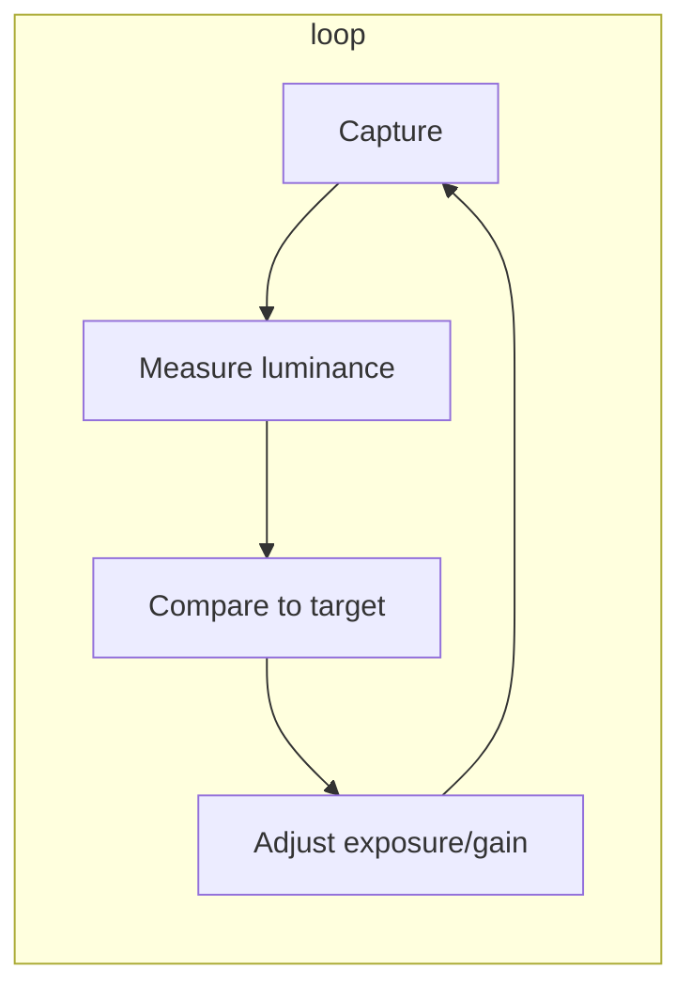

# Auto-exposure and auto-gain algorithm

This document describes how camera auto-exposure (AE) and auto-gain (AG) are typically implemented and how our implementation aligns with that.

## Standard camera approach

1. **Target**: A desired brightness level (e.g. “target grey value”). Often mid-range (e.g. 50% of max) or a band; we use a **band 0.80–0.95** of normalized peak so we avoid saturation and keep good SNR.

2. **Measured signal**: For a spectrometer we use the **spectrum peak** (max of intensity over wavelength) as the single “luminance” metric. Cameras often use mean luminance, histogram, or weighted regions.

3. **Update rule (industry standard)**: Brightness is roughly **linear in exposure and in gain**. So the usual feedback is **multiplicative**:
   - `exposure_new = exposure_old × (target / measured)`  
   - `gain_new = gain_old × (target / measured)`  
   with clamping to hardware limits. One step moves the expected level toward the target; a few iterations settle.

4. **Control type**: Many implementations use a **PI (proportional–integral)** loop or a simple **proportional** multiplicative correction above. We use proportional multiplicative correction plus smoothing and hysteresis.

5. **Exposure vs gain**: Cameras often prefer **exposure** first (less noise) and add **gain** when exposure is at a limit or to keep exposure below a maximum (e.g. to limit motion blur). We do the same: exposure is adjusted first, with a preferred maximum (e.g. 500 ms); gain is only used when needed.

## Our implementation choices

| Aspect | Choice | Reason |
|--------|--------|--------|
| **Update rule** | Multiplicative: `value_new = value_old × (target_peak / smoothed_peak)` | Matches standard camera AE; linear response in exposure/gain. |
| **Target** | Center of band: **0.875** (87.5%); band 0.80–0.95 | Avoids saturation; only act when outside band. |
| **Smoothing** | Exponential moving average of peak (~25 Hz effective) | Filters 50/60 Hz flicker and noise; configurable `peak_smoothing_period_sec`. |
| **Reset on change** | Clear smoothed state when we change exposure/gain | Prevents stale filter state after a big jump. |
| **Skip one frame** | Ignore the frame immediately after a change | Avoids reacting to mid-frame or partial-settings artifacts. |
| **Sustain** | Require 2 consecutive out-of-band readings before acting | Avoids reacting to a single noisy or aliased frame. |
| **One control per frame** | Adjust only exposure or only gain per frame | Prevents the two from fighting. |
| **Exposure priority** | Always try exposure first; only adjust gain when exposure did not change this frame | Keeps gain as low as possible: we only touch gain when exposure is at limit (min/max) or in band. |
| **Exposure preferred max** | Try to reach target with exposure ≤ 500 ms first | Prefer exposure in 0–500 ms (and thus lower gain) before using longer exposure. |

## Config

- **`[auto]`**  
  - **`peak_smoothing_period_sec`** (default `0.04`): Effective smoothing window in seconds (~25 Hz). Shorter exposure → more smoothing (alpha scales with frame period / this value).

## References

- FLIR: “Using Auto Exposure” (target grey value, iterative adjustment).
- Camera 3A (AE, AWB, AF): PID or proportional control; exposure/gain in parallel or serial.
- Multiplicative update: `exposure = exposure × target / measured` with clamping.
