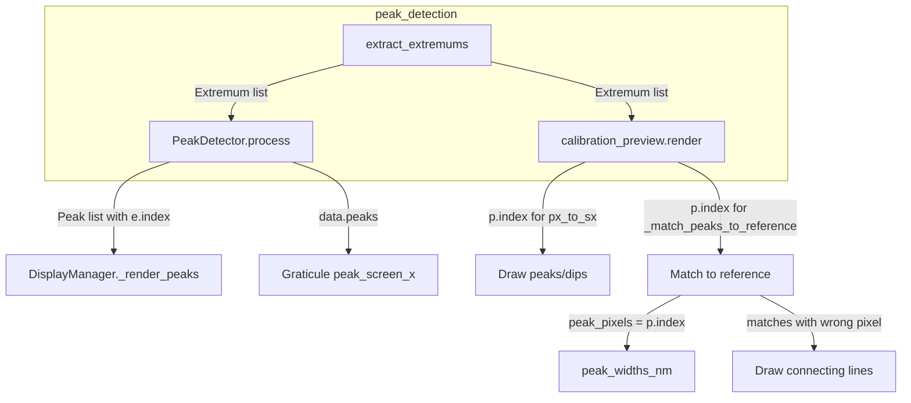
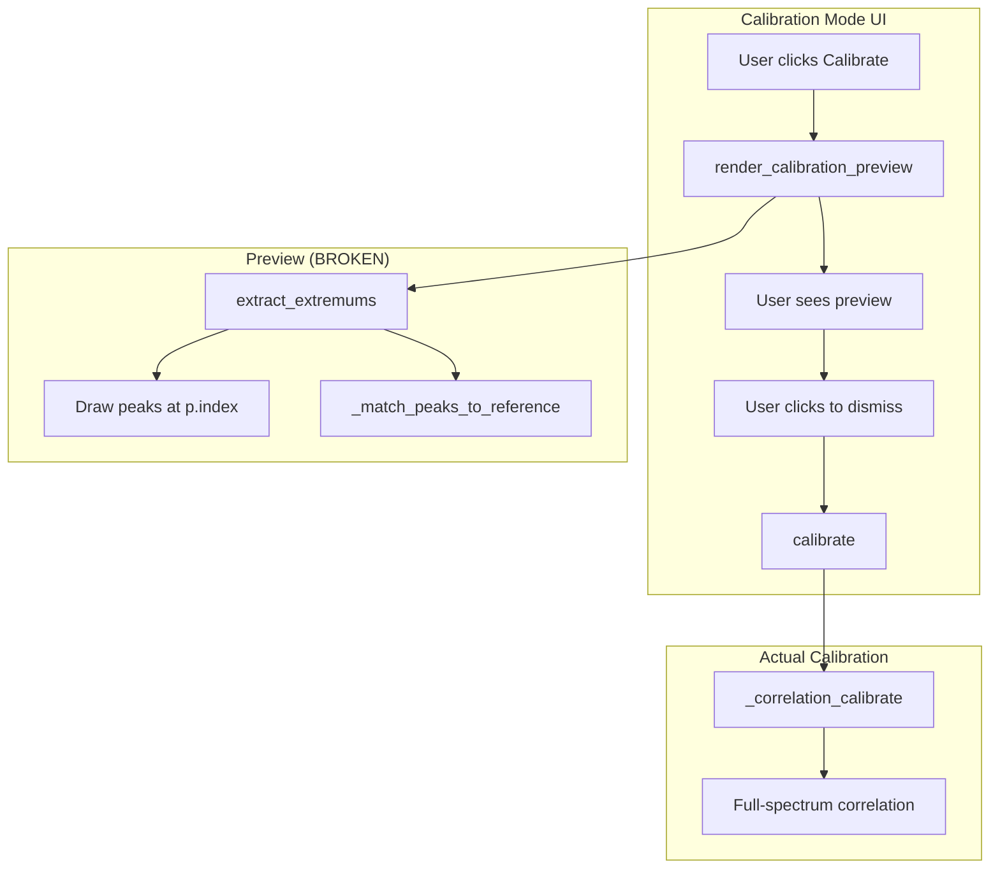

# Investigation: Peaks Drawn at x=0 in Calibration Mode

## Summary

**Root cause**: `extract_extremums()` in `peak_detection.py` assigns `Extremum.index = k` (enumeration index 0, 1, 2, …) instead of `Extremum.index = idx` (actual pixel index in the spectrum).

**Impact**: All consumers that use `Extremum.index` or `Peak.index` for x-coordinate / pixel position receive wrong values. Peaks cluster at the left edge (x≈0) because indices 0, 1, 2, … map to the leftmost pixels.

---

## Data Flow



---

## Bug Location

**File**: `src/pyspectrometer/processing/peak_detection.py`  
**Function**: `extract_extremums` (lines 364–379)

```python
for k, (idx, _, is_dip, h_computed, w_computed) in enumerate(items):
    pos = float(positions[idx])
    # ...
    px = int(position_px[idx]) if position_px is not None else None
    result.append(
        Extremum(
            index=k,           # BUG: k = 0,1,2,... (enumeration)
            position=pos,      # correct: wavelength at peak
            position_px=px,    # correct: pixel when position_px provided
            # ...
        )
    )
```

- `idx` = pixel index from raw peak detection (correct position)
- `k` = loop enumeration index (0, 1, 2, …) — wrong for position

---

## Affected Consumers

| Consumer | Uses | Expected | Actual |
|----------|------|----------|--------|
| **PeakDetector.process** | `e.index` → `Peak.index` | Pixel index | 0, 1, 2, … |
| **DisplayManager._render_peaks** | `p.index` for `data_x_to_screen` | Pixel index | 0, 1, 2, … |
| **calibration_preview** | `p.index` for `px_to_sx`, `peak_pixels` | Pixel index | 0, 1, 2, … |
| **_match_peaks_to_reference** | `peak_pixels` from `p.index` | Pixel indices | 0, 1, 2, … |
| **peak_widths_nm** | `peak_indices` from `peak_pixels` | Pixel indices | 0, 1, 2, … |
| **calibration/matcher** | `position_px` | Pixel index | Correct (uses `position_px`) |

---

## Why Peaks Appear at x=0

1. Peaks get `index` = 0, 1, 2, … instead of real pixel indices (e.g. 100, 250, 400).
2. `px_to_sx(0)` → screen x ≈ 0.
3. `px_to_sx(1)` → screen x ≈ 1 (or scaled by width).
4. All peaks map to the leftmost pixels, so they cluster at x≈0.

---

## Why Matches Are Wrong

1. `peak_pixels = [0, 1, 2, 3, 4]` instead of real indices.
2. Matching treats peaks as if they were at pixels 0–4.
3. Linearity score and match quality use wrong pixel positions.
4. Connecting lines are drawn from wrong x-positions.

---

## Fix

**Single change** in `extract_extremums`:

```python
# Before (wrong)
index=k,

# After (correct)
index=idx,
```

Use the pixel index `idx` from the raw peak detection instead of the enumeration index `k`.

---

## Verification

1. **PeakDetector**: `Peak.index` must be the pixel index (see `Peak` docstring).
2. **calibration_preview**: `px_to_sx(p.index)` must map to correct screen x.
3. **Extremum**: `index` should represent position in the spectrum; `position_px` is for non-1:1 mappings (e.g. cropped data).
4. **Tests**: Run `pytest tests/` and any calibration-related tests.

---

# Impact Analysis: Autocalibration & SOLID

## 1. Impact on Autocalibration

### Calibration Paths



### Per-Path Impact

| Path | Uses peaks? | Uses .index? | Impact of fix |
|------|------------|--------------|---------------|
| **render_calibration_preview** | Yes (extract_extremums) | Yes (px_to_sx, _match_peaks_to_reference) | **Fixes** – preview shows correct peak positions and matches |
| **AutoCalibrator.calibrate()** | No (peak_indices=[]) | No | **None** – correlation uses full spectrum |
| **AutoCalibrator.calibrate_from_peaks()** | Yes | Yes (p.index → pixel_indices) | **Fixes** – if ever used, would get correct pixels |
| **calibration/calibrate.py** (triplet) | Yes (extract_extremums) | No (uses position_px) | **None** – matcher uses position_px only |
| **calibration/detect_peaks.py** | Yes (find_peaks) | Yes (p.index) | **None** – find_peaks returns correct index; not affected |

### Summary

- **Preview**: The fix restores correct peak/dip drawing and match visualization before calibration runs. The calibration result itself comes from correlation and is unaffected.
- **Triplet calibration**: Uses `position_px` exclusively; no change.
- **calibrate_from_peaks**: Would be fixed if used with Peak from PeakDetector.

---

## 2. Impact w.r.t. SRP and SOLID

### Single Responsibility Principle (SRP)

**Current**: `extract_extremums` has one job: detect peaks/dips and return `Extremum` objects with correct position data. Assigning `index=k` violates that by returning wrong position data.

**After fix**: `extract_extremums` correctly fulfills its contract: each `Extremum` carries the pixel index where the peak/dip occurs.

**Conclusion**: The fix improves SRP – the function now does its job correctly.

---

### Open/Closed Principle (OCP)

The fix is a bug correction, not a behavior change. Consumers that depend on `index` being the pixel index are fixed; no new consumers need to be added.

**Conclusion**: Neutral.

---

### Liskov Substitution Principle (LSP)

`Extremum` and `Peak` both expose `index`. The `Peak` docstring states: `index: Pixel index of the peak`. The fix makes `Extremum.index` match that contract when used as a peak-like object.

**Conclusion**: The fix improves LSP compliance.

---

### Interface Segregation Principle (ISP)

`Extremum` has both `index` and `position_px`:

- `index`: intended as pixel index (broken before fix)
- `position_px`: pixel index when `position_px` array is provided (e.g. cropped region)

Current behavior:

- `calibration_preview`, `PeakDetector`, `_match_peaks_to_reference` use `.index`
- `calibration/matcher` uses `.position_px` only

The fix makes `index` the canonical pixel index when the spectrum is 1:1 with pixels. When `position_px` is provided, `position_px[idx]` is the pixel index.

**Recommendation**: Document `Extremum.index` as “pixel index in the spectrum array” and `position_px` as “pixel index in the original sensor when data is cropped/subsampled.” The fix clarifies the contract without changing the interface.

**Conclusion**: The fix improves clarity without changing the interface shape.

---

### Dependency Inversion Principle (DIP)

Consumers depend on the `Extremum` contract. The fix makes the implementation match that contract.

**Conclusion**: Neutral.

---

### Summary: SOLID

| Principle | Impact |
|-----------|--------|
| SRP | Improves – function fulfills its contract |
| OCP | Neutral |
| LSP | Improves – `Extremum.index` matches `Peak.index` semantics |
| ISP | Improves – clearer semantics for `index` vs `position_px` |
| DIP | Neutral |

---

### Potential Design Improvement (Optional)

The dual `index` / `position_px` fields can lead to confusion. A clearer design:

- Use `position_px` as the single source of truth for pixel position.
- When `position_px` is `None`, treat `index` as the pixel index.
- Or add a helper: `def pixel_index(e: Extremum) -> int` that returns `position_px if position_px is not None else index`.

That would be a follow-up refactor; the current fix is a minimal change that corrects the bug without introducing new behavior.
