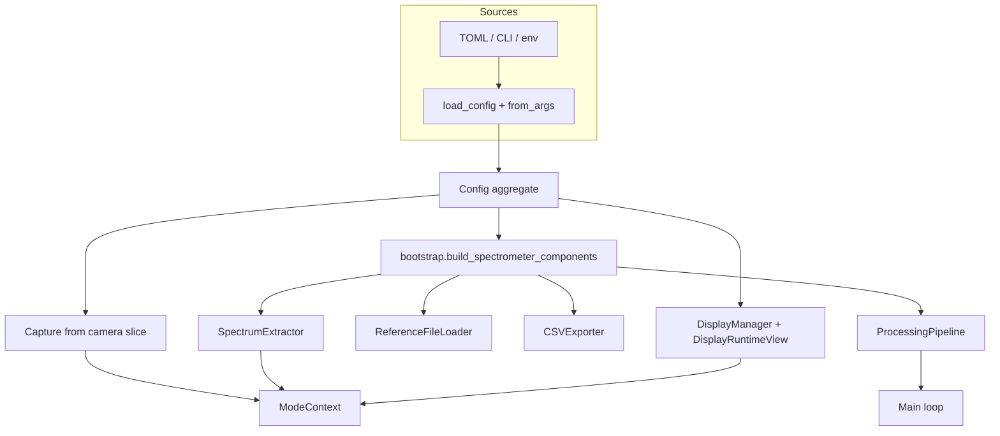

# Configuration passing — current state (post-refactor)

This document describes how configuration reaches modules in PySpectrometer3, remaining friction, and the composition/bootstrap layout after steps **A–F** of the config track. It complements [ARCHITECTURE.md](ARCHITECTURE.md) (application behavior, including **defaults vs calibration**) and [REFACTORING_GUIDE.md](REFACTORING_GUIDE.md) (broader refactor tasks).

---

## 1. Current state (as-is)

### 1.1 Single aggregate model

All persisted and default settings live in one module: `src/pyspectrometer/config.py`. A top-level `Config` dataclass aggregates domain slices:

| Slice | Role |
|-------|------|
| `CameraConfig` | Resolution, gain, backend source, monochrome, bit depth |
| `DisplayConfig` | Window layout, fonts, stack height |
| `ProcessingConfig` | Savitzky–Golay, peak detection, row averaging |
| `CalibrationConfig` | Pixel↔nm tables, rotation, strip geometry (saved with calibration) |
| `ExtractionConfig` | Method, rotation, strip width, y-center, bias strips, etc. |
| `ExportConfig`, `WaterfallConfig`, `MeasurementConfig`, `ColorScienceConfig`, `AutoConfig`, `HardwareConfig`, `SensitivityConfig` | Export paths, UI mode windows, auto gain/exposure, GPIO, sensitivity curve |

TOML load/save uses `_apply_config` / `_config_to_dict` with **manual** field lists for some sections (paths, tuples, legacy keys such as `led_bcm_pin`).

### 1.2 Entry points

1. **`python -m pyspectrometer`**: `load_config(explicit_path)` → `Config.from_args(...)` for CLI overrides → camera start mutates `config.camera` dimensions to match device → `Spectrometer(config, camera, ...)`.
2. **`--csv` viewer**: `load_config` or `load_csv_viewer_config` (overlay + `apply_csv_viewer_preset`).
3. **Scripts** (e.g. `scripts/stream_camera.py`): import `Config`, `Capture`, `SpectrumExtractor`, etc., and wire them similarly to the orchestrator.

### 1.3 How `Spectrometer` uses `Config`

The orchestrator (`spectrometer.py`) is the **composition root**: it calls `build_spectrometer_components(config, ...)` from `bootstrap.py` to construct extractor, processing stack, auto controllers, `ReferenceFileLoader` (from `ReferenceSearchPaths` + `config.export.reference_dirs`), and `CSVExporter`. Camera, calibration, display, and mode wiring stay in `Spectrometer`.

- `Capture(config.camera)` — only camera settings.
- `Calibration(..., config=self.config, ...)` — full `Config` for persistence and sensitivity-related data.
- `SpectrumExtractor` — built via `ExtractorBuildParams.from_config` inside bootstrap (no duplicated field mapping in `Spectrometer`).
- Reference CSVs — **`ReferenceFileLoader`** instance on `Spectrometer` and optional `ModeContext.reference_file_loader`; `get_reference_spectrum(..., file_loader=...)` — **no** process-wide directory mutation.
- `DisplayManager` — receives `Config` to build a **`DisplayRuntimeView`** (`self._ui`); modes and helpers use **`ctx.display.runtime`** for UI-facing slices (fonts, waterfall, measurement, color science, peak regions), not the full aggregate.

`ModeContext` holds services (`camera`, `extractor`, `display`, …) and may hold **`reference_file_loader`**; it does **not** expose `Config` directly.

### 1.4 Duplication and runtime sources of truth

- **Calibration vs extraction**: `CalibrationConfig` and `ExtractionConfig` both carry `rotation_angle`, `spectrum_y_center`, and `perpendicular_width`. On each frame, the orchestrator syncs extractor geometry from **`Calibration`** (not from `config.extraction`) after loading calibration:

```706:708:src/pyspectrometer/spectrometer.py
        self._extractor.set_rotation_angle(self._calibration.rotation_angle)
        self._extractor.set_spectrum_y_center(self._calibration.spectrum_y_center)
        self._extractor.set_perpendicular_width(self._calibration.perpendicular_width)
```

So the **file** may list both; **runtime** geometry for the strip follows calibration once loaded.

- **Display** reads cross-cutting concerns: `display.*`, `waterfall.*`, `color_science.*`, `measurement.*`, and even `processing.peak_include_region_half_width` for click regions — a single `Config` reference keeps the UI flexible but couples the renderer to many unrelated slices.

---

## 2. Pain points (why change)

| Issue | Effect |
|-------|--------|
| **God object** | Any module that takes `Config` can depend on the whole app; harder to test and reason about boundaries. |
| **Long constructor lists** | `SpectrumExtractor` and similar types take many parameters duplicated from `ExtractionConfig` + layout — easy to drift when adding a field. |
| **Split brain** | Mitigated: [ARCHITECTURE.md §2.1](ARCHITECTURE.md#21-config-defaults-vs-loaded-calibration) documents calibration vs TOML defaults for strip geometry. |
| **Imperative wiring** | Reduced via `bootstrap`; `stream_camera.py` documents a minimal Pi-only stack. |

---

## 3. Target architecture (implemented)

Principles:

1. **Keep one serialized `Config`** (or one TOML) for users — no need to split files unless the product demands it.
2. **Pass narrow types at boundaries**: factories accept `Config` or a slice and build **typed bundles** (e.g. `ExtractorBuildParams`) so downstream code does not take 10+ loose parameters.
3. **Explicit composition root**: `bootstrap.build_spectrometer_components` — main app and CLI reuse it; tests can build `ExtractorBuildParams` without TOML.
4. **UI-facing read model**: `DisplayRuntimeView` (`config.DisplayRuntimeView.from_config`) — modes use `ctx.display.runtime`, not `ctx.display.config`.
5. **Documented in [ARCHITECTURE.md](ARCHITECTURE.md)** — “defaults vs calibration” for overlapping extraction/calibration keys (see §2.1 there).



---

## 4. Migration steps (incremental, commit-sized)

These are ordered so each step stays testable and reversible.

| Step | Action | Outcome |
|------|--------|---------|
| **A** | Add `ExtractorBuildParams` (or `namedtuple`/dataclass) in `processing/` with fields needed to construct `SpectrumExtractor` + a classmethod `from_config(config: Config) -> ExtractionBuildParams`. | **Done** — see `processing/extractor_params.py`. |
| **B** | Add `build_spectrum_extractor(params: ExtractorBuildParams) -> SpectrumExtractor` (or constructor on the params object). | **Done** — same module; calibration still overrides geometry in `Spectrometer` after load. |
| **C** | `bootstrap.py` + `SpectrometerComponents` — extractor, pipeline, auto controllers, `ReferenceFileLoader`, exporter. | **Done** — `Spectrometer` calls `build_spectrometer_components`; camera, calibration, display remain in orchestrator. |
| **D** | `ReferenceSearchPaths`, `ReferenceFileLoader`, thread `file_loader` through `get_reference_spectrum` and CSV viewer / CLI. | **Done** — no `set_reference_dirs`; tests use `default_reference_file_loader()` where needed. |
| **E** | `DisplayRuntimeView` — `DisplayManager` stores `_ui`; **`runtime`** property for modes (replaces ad-hoc `ctx.display.config` for UI slices). | **Done** |
| **F** | Document defaults vs calibration overrides. | **Done** — see [ARCHITECTURE.md §2.1](ARCHITECTURE.md#21-config-defaults-vs-loaded-calibration) |

**Non-goals for this track:** Rewriting persistence to JSON/YAML; splitting into microservices; changing calibration file format without migration.

---

## 5. Acceptance criteria (when refactors are “done”)

- New extraction-related settings require updating **one** `from_config` mapping (or one dataclass), not every call site.
- `Spectrometer.__init__` is mostly delegation or a single `components = build_from_config(...)` assignment.
- `stream_camera.py` (or similar) uses the shared factory or documents why it cannot (e.g. minimal Pi-only subset).
- Tests for extraction can construct `ExtractorBuildParams` without loading TOML.

---

## 6. Related code references

| Area | File |
|------|------|
| Aggregate config + load/save + `DisplayRuntimeView` | `src/pyspectrometer/config.py` |
| `SpectrometerComponents`, `build_reference_file_loader` | `src/pyspectrometer/bootstrap.py` |
| Reference search + loader + CSV cache | `src/pyspectrometer/data/reference_paths.py`, `reference_loader.py`, `reference_spectra.py` |
| Orchestrator | `src/pyspectrometer/spectrometer.py` |
| CLI merge order | `src/pyspectrometer/__main__.py` |
| Mode services | `src/pyspectrometer/core/mode_context.py` |
| CSV viewer overlay | `load_csv_viewer_config` in `config.py`; `src/pyspectrometer/csv_viewer/spectrometer.py` builds `reference_file_loader` |

---

*Last updated: 2026-03-31*
