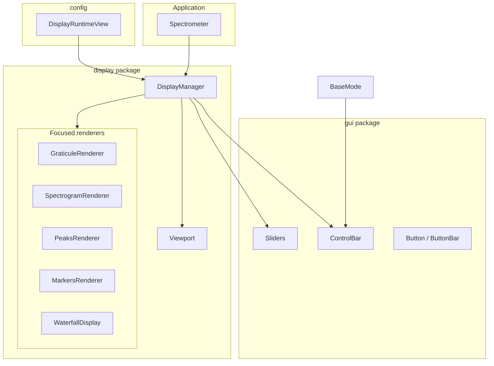
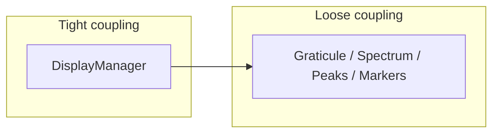
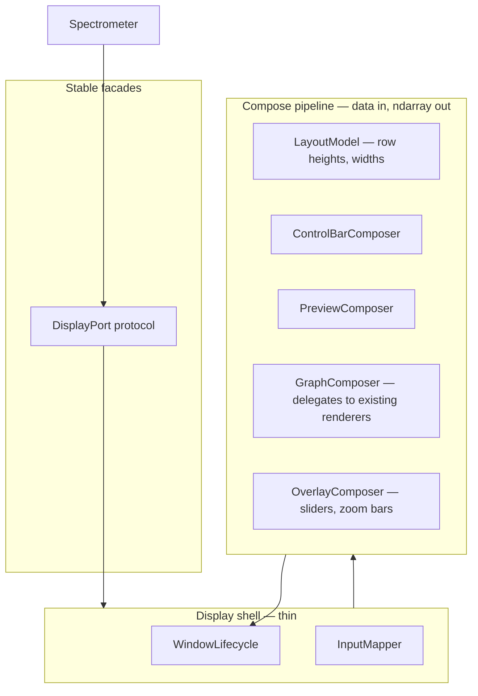

# Display & GUI — Current Architecture, Target Architecture, and Migration Plan

This document describes the **present** layout of display and GUI code in PySpectrometer3, a **target** shape optimized for maintainability, composability, extensibility, performance, and UX, and a **phased plan** to get there with minimal duplicated logic. It complements [REFACTORING_GUIDE.md](REFACTORING_GUIDE.md) and project [ARCHITECTURE.md](ARCHITECTURE.md) (if present).

---

## 1. Scope

| In scope | Primary locations |
|----------|-------------------|
| Live OpenCV UI | `display/renderer.py` (`DisplayManager`), `display/*.py` (plot layers), `gui/*.py` (widgets), `utils/display.py` (pure scaling) |
| Configuration driving layout | `config.py` — `DisplayConfig`, `DisplayRuntimeView` |
| Mode integration | `modes/base.py` — buttons, `preview_modes`, overlays; `spectrometer.py` — orchestration |
| Out of scope for this doc | CSV viewer (`csv_viewer/`), headless export-only paths unless they share widgets |

---

## 2. Current architecture

### 2.1 Layering (as implemented)

**What works well today**

- **Separation of graph primitives**: Graticule, spectrum fill/line, peaks, markers, waterfall, and viewport math live in dedicated modules; they are largely **pure drawing** given `SpectrumData` and `Viewport`.
- **Config slice**: `DisplayRuntimeView` centralizes titles, dimensions, and mode-specific UI knobs (measurement viewport, color science, waterfall).
- **Mode-driven chrome**: `BaseMode.get_buttons()` is the single source for control bar content; clicks route through `mode_instance.handle_action`.
- **Shared overlay primitive**: `overlay_utils.render_polyline_overlay` consolidates polylines for reference lines and sensitivity curves.

### 2.2 Implementation hotspots

| Area | Role today | Risk |
|------|------------|------|
| `DisplayManager` (~1.6k lines) | Owns window lifecycle, `cv2.imshow`, mouse routing, zoom/pan, marker logic, preview modes, vertical stack composition, waterfall branching, control bar status sync, slider overlay positioning | **God object**: every new feature tends to touch one file; hard to unit-test in isolation |
| `DisplayState` dataclass | Holds cross-cutting UI state (markers, peaks visibility, cursor, graph click behavior) | Mixed **presentation** and **session** concerns; some fields are mode-specific |
| Duplicate scaling helpers | `_scale_to_fit` in `renderer.py` vs `scale_to_uint8` in `utils/display.py` | Small DRY gap; both are display-adjacent |
| Input dispatch | `_handle_mouse` is a long chain of conditionals | Adding a new interaction requires editing central dispatch |
| Performance | Full-frame `np.vstack`, repeated `cv2.resize` on hot path | Acceptable for USB spectrometers but no explicit **frame budget** or dirty regions |

### 2.3 Modularity snapshot

Focused renderers are **modular**; **DisplayManager** is the **integration point** where coupling concentrates.

---

## 3. Desired architecture

### 3.1 Goals

| Goal | Meaning for this codebase |
|------|---------------------------|
| **Maintainability** | Changes to one concern (e.g. marker UX) do not require editing unrelated branches (e.g. waterfall window layout) |
| **Composability** | Stack “layers” (control bar, preview strip, graph, overlays) as a small pipeline with explicit inputs/outputs |
| **Extensibility** | New modes or preview layouts add classes or config, not new `if mode ==` chains in one mega-method |
| **Performance** | Optional: reuse buffers, avoid redundant resizes, document expected frame cost |
| **UX** | Consistent hit-testing, documented preview modes, eventual accessibility notes if toolkit changes |

### 3.2 Target shape (conceptual)

**Principles**

1. **`DisplayPort` (protocol)**: `Spectrometer` depends on a narrow interface (`setup_windows`, `render`, `set_status`, button/slider registration, `viewport`, `state` accessors) — see REFACTORING_GUIDE §2.2. Enables tests with a fake display.
2. **Compose pipeline**: One function or class builds the final BGR frame from immutable inputs (`SpectrumData`, `DisplayState`, layout constants) instead of interleaving composition inside `render()` branches.
3. **Input mapper**: Map window coordinates → semantic regions (control bar, graph, slider) → delegate to small handlers (markers, pan, peak region). Reduces growth of `_handle_mouse`.
4. **Keep OpenCV optional at boundaries**: Pure numpy steps stay testable; only the shell calls `cv2.imshow`.

### 3.3 GUI package evolution

| Component | Today | Target |
|-----------|--------|--------|
| `gui/buttons.py` | Solid, self-contained | Keep; optionally extract **theme** (colors/fonts) to a small `gui/theme.py` |
| `gui/control_bar.py` | Layout + render + hit test | Keep; ensure **only** mode definitions supply buttons (REFACTORING_GUIDE §1.1 done in spirit) |
| `gui/sliders.py` | Absolute coordinates | Consider **relative** layout from `LayoutModel` to avoid `dy` hacks in `_render_overlays` |

---

## 4. Migration plan (phased, reversible)

Align with [REFACTORING_GUIDE.md](REFACTORING_GUIDE.md); order minimizes risk.

### Phase A — Document and stabilize boundaries (no behavior change)

1. **Freeze public surface** of `DisplayManager` used by `spectrometer.py` (list methods/properties; treat as API).
2. **Add `DisplayPort` protocol** + `typing.cast` or structural checks; `DisplayManager` implements it (REFACTORING_GUIDE §2.2.1).
3. **Move pure helpers**: consolidate `_scale_to_fit` and any duplicate resize/letterbox logic next to `utils/display.py` with tests.

### Phase B — Extract composition from `render()`

1. Introduce **`FrameComposer`** (or module-level functions) that takes: `messages`, `cropped`, `graph`, `waterfall_img`, `preview_mode`, dimensions — returns `spectrum_vertical` and optional second window buffer. **Move** the `match self._preview_mode` / waterfall branching into this unit; `DisplayManager.render` orchestrates data prep then calls composer.
2. **Unit-test** composer with small synthetic arrays (shapes, not pixels).

### Phase C — Extract input routing

1. Split `_handle_mouse` into **`Region` enum** + **`handle_graph_event`**, **`handle_control_bar`**, **`handle_sliders`** with shared context object (`MouseContext`).
2. Keep behavior parity; add tests where possible with mocked positions.

### Phase D — State hygiene

1. Split **`DisplayState`** into **UI chrome** (what draw needs) vs **mode-owned** flags where practical, or document fields by mode to avoid accidental coupling.
2. Consider **immutable snapshots** per frame for debugging (“what was shown”) — optional.

### Phase E — Performance (optional, measure first)

1. Profile one session on target hardware; list top `cv2.resize` / `vstack` sites.
2. Introduce **buffer reuse** (`np.ndarray` scratch buffers) only where profiling shows allocation churn.
3. Avoid premature optimization; spectrometer rates are often camera-bound.

### Phase F — Future toolkit (only if product requires)

If Qt/GTK or a web UI is ever needed, **`DisplayPort`** becomes the seam: implement a second backend; keep `FrameComposer` output as numpy BGR or delegate entirely to native widgets. Not scheduled here.

---

## 5. Success criteria

- [ ] `DisplayManager` **line count** trends down as composers/handlers extract (target: &lt; 800 lines for orchestration-only, rest in small modules).
- [ ] **No duplicated** letterbox/scale-to-fit logic across `renderer.py` and utilities.
- [ ] **Spectrometer** imports **`DisplayPort`**, not concrete class, in type hints and constructors (DI-ready).
- [ ] **Manual smoke**: all preview modes, waterfall on/off, calibration markers, zoom sliders — behavior unchanged.
- [ ] **Tests**: composer + viewport edge cases covered; existing `test_display_*` / OpenCV tests still pass.

---

## 6. Related documents

- [SPECTRUM_TRACE_MODEL.md](SPECTRUM_TRACE_MODEL.md) — unified traces, markers, overlays, metadata, and allocation plan (measured vs reference, calibration assist, export parity).
- [REFACTORING_GUIDE.md](REFACTORING_GUIDE.md) — broader SRP tasks (callbacks registry, Spectrometer slim-down).
- [CONFIGURATION_ARCHITECTURE.md](CONFIGURATION_ARCHITECTURE.md) — how `DisplayRuntimeView` fits config.
- [ARCHITECTURE.md](ARCHITECTURE.md) — project-wide module map (if maintained).

---

*Last updated: 2026-03-31 — produced as an /implement refactor review deliverable.*
