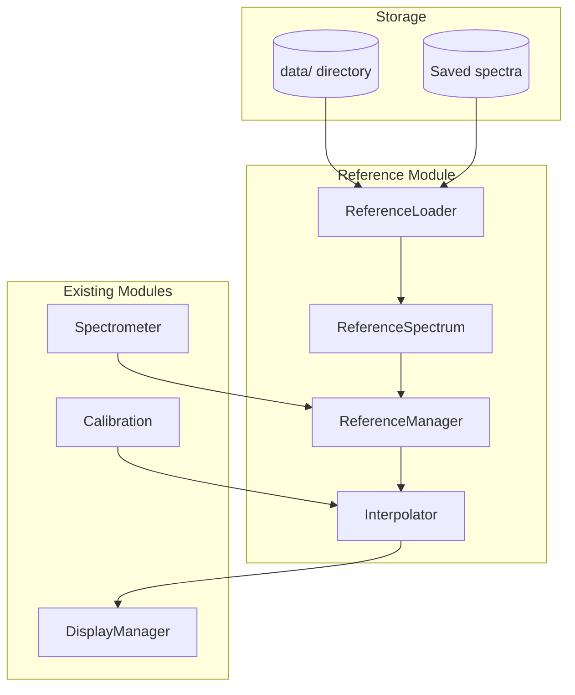
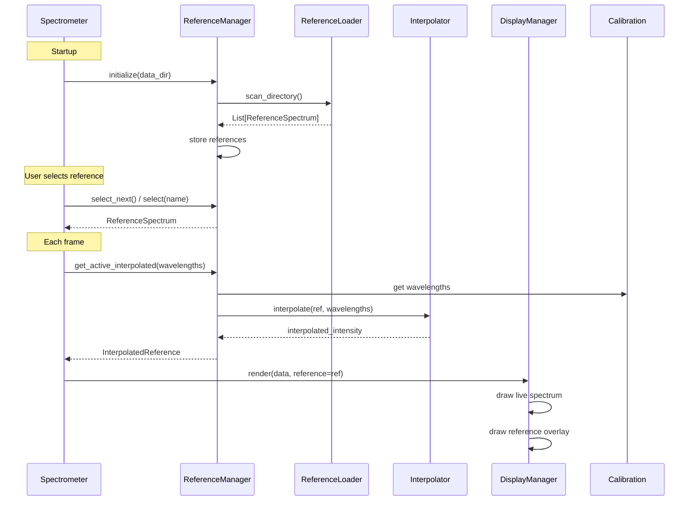

# Reference Spectrum Overlay Feature

## Overview

This feature allows users to load reference spectra (from the `data/` directory) and display them as overlays on the live spectrum graph. This enables visual comparison between the measured spectrum and known reference spectra (e.g., fluorescent lamps, solar spectrum, blackbody radiation, previously saved measurements).

## Requirements

### Functional Requirements

| ID | Requirement | Priority |
|----|-------------|----------|
| FR-01 | Load reference spectra from `data/` directory on startup | Must |
| FR-02 | Display single reference spectrum as overlay on live graph | Must |
| FR-03 | Cycle through available reference spectra | Must |
| FR-04 | Toggle reference overlay visibility on/off | Must |
| FR-05 | Auto-detect and parse multiple CSV/PRN formats | Must |
| FR-06 | Interpolate reference to match camera wavelength calibration | Must |
| FR-07 | Normalize reference intensity to match display scale | Must |
| FR-08 | Load previously saved spectrum files as references | Should |
| FR-09 | Display reference name/label on screen | Should |
| FR-10 | Support GUI-based interaction (no keyboard dependency) | Must |

### Non-Functional Requirements

| ID | Requirement |
|----|-------------|
| NFR-01 | Reference loading must complete within 500ms |
| NFR-02 | Overlay rendering must not impact frame rate (<1ms per frame) |
| NFR-03 | Support wavelength ranges from 200nm to 1100nm |
| NFR-04 | Memory usage: <10MB for reference library |

## Architecture

### Module Structure

```
src/pyspectrometer/
├── reference/                    # NEW module
│   ├── __init__.py              # Public exports
│   ├── spectrum.py              # ReferenceSpectrum dataclass
│   ├── loader.py                # File format parsers
│   ├── interpolator.py          # Wavelength resampling
│   └── manager.py               # Reference library management
├── display/
│   └── renderer.py              # MODIFIED: Add overlay rendering
└── config.py                    # MODIFIED: Add reference config
```

### Component Diagram



### Data Flow



## Data Structures

### ReferenceSpectrum

```python
@dataclass
class ReferenceSpectrum:
    """Loaded reference spectrum data."""
    
    name: str                      # Display name (filename without extension)
    source_path: Path              # Original file path
    wavelengths: np.ndarray        # Wavelength values (nm)
    intensity: np.ndarray          # Intensity values (normalized 0-1)
    
    # Metadata (optional, parsed from file headers)
    description: str = ""          # e.g., "CIE D65 6500K Daylight"
    source: str = ""               # e.g., "CIE", "NIST", "User"
    wavelength_unit: str = "nm"    # Original unit
    intensity_unit: str = ""       # Original unit (for info display)
    
    @property
    def min_wavelength(self) -> float:
        return float(self.wavelengths[0])
    
    @property
    def max_wavelength(self) -> float:
        return float(self.wavelengths[-1])
    
    @property
    def resolution(self) -> float:
        """Average wavelength step size."""
        return float(np.mean(np.diff(self.wavelengths)))
```

### InterpolatedReference

```python
@dataclass
class InterpolatedReference:
    """Reference spectrum interpolated to camera wavelengths."""
    
    name: str
    intensity: np.ndarray          # Interpolated to camera pixel count
    scale_factor: float            # Applied normalization factor
    in_range_mask: np.ndarray      # Boolean mask: True where reference has data
```

### ReferenceConfig

```python
@dataclass
class ReferenceConfig:
    """Configuration for reference overlay feature."""
    
    data_directory: Path = Path("data")
    saved_directory: Path = Path(".")       # Where saved spectra go
    
    # File patterns to load
    patterns: list[str] = field(default_factory=lambda: [
        "*.csv",
        "*.prn", 
        "*.txt",
    ])
    
    # Display settings
    overlay_color: tuple[int, int, int] = (255, 0, 255)  # Magenta BGR
    overlay_thickness: int = 2
    overlay_alpha: float = 0.7              # Transparency (1.0 = opaque)
    
    # Normalization
    normalize_to_max: bool = True           # Scale to match live spectrum max
    fixed_scale: float = 1.0                # Used if normalize_to_max=False
```

## File Format Support

### Supported Formats

| Format | Extension | Description | Example |
|--------|-----------|-------------|---------|
| Simple CSV | `.csv` | `wavelength,intensity` | Saved spectra |
| CIE CSV | `.csv` | `wavelength,value` (no header or numeric header) | CIE illuminants |
| Multi-column CSV | `.csv` | First column = wavelength, select column | ASTM G173 |
| PRN | `.prn` | Space-separated with header comments | Helsinki lamps |
| Mercury lines | `.csv` | Discrete emission lines | Low-pressure Hg |

### Format Detection Logic

```python
class FormatDetector:
    """Auto-detect CSV/PRN file format."""
    
    def detect(self, path: Path) -> FileFormat:
        """
        Detection strategy:
        1. Check extension (.prn -> PRN format)
        2. Read first 10 lines
        3. Check for comment lines (# or ")
        4. Check for header row (non-numeric first row)
        5. Count columns and determine delimiter
        6. Return appropriate parser
        """
```

### Parser Interface

```python
class ParserInterface(ABC):
    """Base interface for spectrum file parsers."""
    
    @abstractmethod
    def can_parse(self, path: Path, preview: list[str]) -> bool:
        """Check if this parser can handle the file."""
        pass
    
    @abstractmethod
    def parse(self, path: Path) -> ReferenceSpectrum:
        """Parse file and return spectrum data."""
        pass
```

### Implemented Parsers

1. **SimpleCSVParser**: `Wavelength,Intensity` format (saved spectra)
2. **CIEParser**: Numeric-only CSV with wavelength in first column
3. **MultiColumnParser**: Select specific column from multi-column CSV
4. **PRNParser**: Helsinki `.prn` format with header metadata
5. **DiscreteLineParser**: Emission line spectra (few discrete wavelengths)

## Interpolation

### Strategy

Reference spectra have different wavelength ranges and resolutions than the camera's calibrated wavelengths. Interpolation is required to align them.

```python
class Interpolator:
    """Resample reference spectrum to camera wavelengths."""
    
    def interpolate(
        self,
        reference: ReferenceSpectrum,
        target_wavelengths: np.ndarray,
    ) -> InterpolatedReference:
        """
        Interpolation strategy:
        
        1. For continuous spectra (resolution < 5nm):
           - Use scipy.interpolate.interp1d with 'linear' or 'cubic'
           - Extrapolate to 0 outside reference range
        
        2. For discrete line spectra (resolution > 50nm or few points):
           - Create Gaussian peaks at each emission line
           - FWHM based on spectrometer resolution (~2-5nm)
        
        3. Mask out-of-range regions:
           - Mark wavelengths outside reference range
           - Allow display to show gaps or fade
        """
```

### Normalization Options

| Mode | Description | Use Case |
|------|-------------|----------|
| `max_match` | Scale reference max to live spectrum max | Default comparison |
| `area_match` | Scale to match integrated area | Relative intensity |
| `fixed` | Apply fixed scale factor | Absolute comparison |
| `peak_match` | Align specific peak intensities | Calibration verification |

## Display Integration

### DisplayManager Changes

```python
class DisplayManager:
    """Extended with reference overlay support."""
    
    def __init__(self, ...):
        # Existing init...
        self._reference: Optional[InterpolatedReference] = None
        self._reference_visible: bool = True
    
    def set_reference(self, reference: Optional[InterpolatedReference]) -> None:
        """Set the active reference overlay."""
        self._reference = reference
    
    def toggle_reference_visibility(self) -> None:
        """Toggle reference overlay on/off."""
        self._reference_visible = not self._reference_visible
    
    def _render_reference_overlay(
        self,
        graph: np.ndarray,
        wavelengths: np.ndarray,
    ) -> None:
        """Render reference spectrum as overlay line."""
        if self._reference is None or not self._reference_visible:
            return
        
        ref = self._reference
        height = graph.shape[0]
        color = self.config.reference.overlay_color
        thickness = self.config.reference.overlay_thickness
        
        # Scale intensity to graph height (0-255 -> 0-height)
        scaled = (ref.intensity * height / 255).astype(int)
        
        # Draw as connected line segments
        points = []
        for i, intensity in enumerate(scaled):
            if ref.in_range_mask[i]:
                y = height - intensity
                points.append((i, y))
        
        if len(points) > 1:
            points_array = np.array(points, dtype=np.int32)
            cv2.polylines(
                graph,
                [points_array],
                isClosed=False,
                color=color,
                thickness=thickness,
                lineType=cv2.LINE_AA,
            )
        
        # Draw reference name label
        self._render_reference_label(graph, ref.name)
```

### Visual Design

```
┌─────────────────────────────────────────────────────────────┐
│  PySpectrometer 3                    [Reference: CIE D65]   │
│  github.com/...                      [Ref: ON] ← status    │
├─────────────────────────────────────────────────────────────┤
│  ▓▓▓▓▓▓▓▓▓▓▓▓▓▓▓▓▓▓▓▓▓▓▓▓▓▓▓▓▓▓  (camera preview)          │
├─────────────────────────────────────────────────────────────┤
│  │                                                          │
│  │    ╱╲        Live spectrum (colored fill)                │
│  │   ╱  ╲   ╱╲                                              │
│  │  ╱    ╲ ╱  ╲    ╱╲                                       │
│  │ ╱      ╳    ╲  ╱  ╲                                      │
│  │╱            ╲╱    ╲╱                                     │
│  │─────────────────────────────── Reference overlay (line)  │
│  │  ┈┈┈╱╲┈┈┈┈┈┈┈╱╲┈┈┈┈┈┈┈┈┈┈┈┈┈  (magenta dashed line)      │
│  │   ╱    ╲   ╱    ╲                                        │
│  └──┴──────┴─┴──────┴───────────────────────────────────────│
│  400nm     500nm    600nm    700nm                          │
└─────────────────────────────────────────────────────────────┘
```

## ReferenceManager API

### Public Interface

```python
class ReferenceManager:
    """Manages reference spectrum library and selection."""
    
    def __init__(self, config: ReferenceConfig):
        self._config = config
        self._references: dict[str, ReferenceSpectrum] = {}
        self._active_name: Optional[str] = None
        self._loader = ReferenceLoader()
        self._interpolator = Interpolator()
    
    # --- Library Management ---
    
    def load_directory(self, directory: Path = None) -> int:
        """
        Scan directory and load all valid reference files.
        Returns number of references loaded.
        """
    
    def load_file(self, path: Path) -> Optional[str]:
        """
        Load single file as reference.
        Returns reference name if successful, None if failed.
        """
    
    def reload(self) -> int:
        """Reload all references from configured directories."""
    
    # --- Reference Access ---
    
    @property
    def names(self) -> list[str]:
        """List of available reference names (sorted)."""
    
    @property
    def count(self) -> int:
        """Number of loaded references."""
    
    def get(self, name: str) -> Optional[ReferenceSpectrum]:
        """Get reference by name."""
    
    # --- Selection ---
    
    @property
    def active(self) -> Optional[ReferenceSpectrum]:
        """Currently selected reference (or None)."""
    
    @property
    def active_name(self) -> Optional[str]:
        """Name of currently selected reference."""
    
    def select(self, name: str) -> bool:
        """Select reference by name. Returns True if found."""
    
    def select_next(self) -> Optional[str]:
        """Select next reference (cycle). Returns new name."""
    
    def select_previous(self) -> Optional[str]:
        """Select previous reference (cycle). Returns new name."""
    
    def clear_selection(self) -> None:
        """Deselect current reference (hide overlay)."""
    
    # --- Interpolation ---
    
    def get_interpolated(
        self,
        wavelengths: np.ndarray,
        normalize_to: Optional[np.ndarray] = None,
    ) -> Optional[InterpolatedReference]:
        """
        Get active reference interpolated to given wavelengths.
        
        Args:
            wavelengths: Target wavelength array (from calibration)
            normalize_to: Optional intensity array to normalize against
        
        Returns:
            InterpolatedReference ready for display, or None if no selection
        """
```

### Usage in Spectrometer

```python
class Spectrometer:
    def __init__(self, ...):
        # ... existing init ...
        
        self._reference_manager = ReferenceManager(
            config=self.config.reference
        )
        self._reference_manager.load_directory()
    
    def run(self) -> None:
        # ... existing loop ...
        
        while self._running:
            # ... capture and process ...
            
            # Get interpolated reference for display
            ref_overlay = self._reference_manager.get_interpolated(
                wavelengths=self._calibration.wavelengths,
                normalize_to=processed.intensity if self.config.reference.normalize_to_max else None,
            )
            
            self._display.set_reference(ref_overlay)
            self._display.render(processed, ...)
    
    # --- GUI Callbacks (to be connected by future GUI) ---
    
    def reference_select_next(self) -> Optional[str]:
        """Cycle to next reference. Returns new name for GUI update."""
        return self._reference_manager.select_next()
    
    def reference_select_previous(self) -> Optional[str]:
        """Cycle to previous reference. Returns new name for GUI update."""
        return self._reference_manager.select_previous()
    
    def reference_select(self, name: str) -> bool:
        """Select specific reference by name."""
        return self._reference_manager.select(name)
    
    def reference_toggle(self) -> bool:
        """Toggle reference visibility. Returns new state."""
        self._display.toggle_reference_visibility()
        return self._display._reference_visible
    
    def reference_clear(self) -> None:
        """Clear reference selection (hide overlay)."""
        self._reference_manager.clear_selection()
        self._display.set_reference(None)
    
    @property
    def reference_names(self) -> list[str]:
        """Get list of available reference names for GUI."""
        return self._reference_manager.names
    
    @property
    def active_reference_name(self) -> Optional[str]:
        """Get currently active reference name for GUI."""
        return self._reference_manager.active_name
```

## GUI Integration Points

The design separates logic from input handling to support future GUI refactoring:

### Callback Methods (Spectrometer)

| Method | Purpose | GUI Widget |
|--------|---------|------------|
| `reference_select_next()` | Cycle forward | Button / Gesture |
| `reference_select_previous()` | Cycle backward | Button / Gesture |
| `reference_select(name)` | Direct selection | Dropdown / List |
| `reference_toggle()` | Show/hide overlay | Toggle button |
| `reference_clear()` | Remove overlay | Button |
| `reference_names` | Populate list | Dropdown options |
| `active_reference_name` | Show current | Label / Selection |

### Event-Based Architecture (Future)

```python
class SpectrometerEvents:
    """Event system for GUI integration."""
    
    # Reference events
    on_reference_changed: Event[str]           # New reference selected
    on_reference_list_updated: Event[list[str]] # References reloaded
    on_reference_visibility_changed: Event[bool] # Toggled on/off
```

## Testing Strategy

### Unit Tests

| Test | Module | Coverage |
|------|--------|----------|
| `test_simple_csv_parser` | loader.py | Saved spectrum format |
| `test_cie_parser` | loader.py | CIE illuminant format |
| `test_prn_parser` | loader.py | Helsinki .prn format |
| `test_discrete_line_parser` | loader.py | Mercury emission lines |
| `test_interpolation_continuous` | interpolator.py | Smooth spectra |
| `test_interpolation_discrete` | interpolator.py | Line spectra to peaks |
| `test_manager_cycle` | manager.py | Next/previous selection |
| `test_manager_load` | manager.py | Directory scanning |
| `test_normalization` | interpolator.py | Scale matching |

### Integration Tests

| Test | Description |
|------|-------------|
| `test_overlay_render` | Reference displays correctly on graph |
| `test_wavelength_alignment` | Reference peaks align with live peaks |
| `test_out_of_range_handling` | Graceful handling of mismatched ranges |

### Test Data

Use files in `data/` directory:
- `CIE_D65_6500K_daylight.csv` - Continuous, 300-830nm
- `ASTM_G173_solar_spectrum.csv` - Multi-column, 280-4000nm
- `low_pressure_mercury_lamp.csv` - Discrete lines
- `fluorescent_TLD36W865_cool_daylight.prn` - PRN format, 300-900nm

## Implementation Plan

### Phase 1: Core Loading (Priority: High)
1. Create `reference/spectrum.py` - ReferenceSpectrum dataclass
2. Create `reference/loader.py` - File parsers
3. Create `reference/manager.py` - Basic management
4. Add tests for each parser

### Phase 2: Interpolation (Priority: High)
1. Create `reference/interpolator.py`
2. Implement linear interpolation for continuous spectra
3. Implement Gaussian peak generation for discrete lines
4. Add normalization modes

### Phase 3: Display Integration (Priority: High)
1. Extend `DisplayManager` with overlay rendering
2. Add reference label display
3. Update `config.py` with ReferenceConfig

### Phase 4: Spectrometer Integration (Priority: Medium)
1. Add `ReferenceManager` to `Spectrometer`
2. Implement callback methods for GUI
3. Load references on startup
4. Wire into render loop

### Phase 5: Polish (Priority: Low)
1. Add overlay color/style options
2. Improve out-of-range visualization
3. Add reference metadata display
4. Performance optimization if needed

## Open Questions

1. **Wavelength range mismatch**: How to visualize when reference doesn't cover camera's full range?
   - *Proposed*: Fade/dim the overlay line at boundaries, or show gap

2. **Multiple column selection**: For ASTM G173 with 4 columns, which to use?
   - *Proposed*: Default to "global" or column 2; allow config override

3. **User-saved references**: Should saved spectra auto-appear in reference list?
   - *Proposed*: Yes, scan saved directory as secondary source

4. **Large file handling**: Some reference files are large (4000 wavelengths)
   - *Proposed*: Downsample during load if >2000 points (camera is ~800 pixels)

---

*Document Version: 1.0*
*Last Updated: 2026-03-08*
*Author: AI Assistant*
