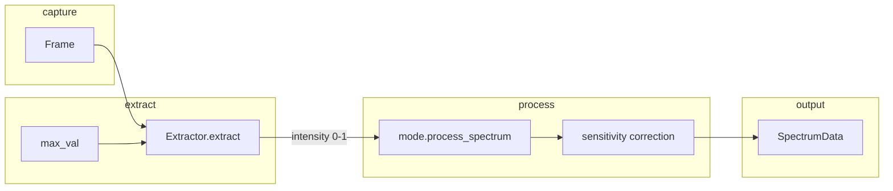

# Spectrum intensity, gain/exposure awareness, and standardization

This document describes the spectrum pipeline, how intensity relates to gain and exposure, and whether measurement code can handle SPD that is not normalized to 1 or area.

## Current pipeline (summary)

1. **Extraction** (`processing/extraction.py`): Raw frame → rotate → grayscale → method (median/weighted_sum/gaussian) → **intensity = raw / max_val** (0–1 by bit depth). No gain or exposure used here.
2. **Mode processing** (`spectrometer._process_intensity`): Optional freeze/hold, accumulation, then `mode.process_spectrum(intensity, wavelengths)` (dark/white correction, optional normalize-to-reference). Still 0–1 for display.
3. **Calibration** (calibration mode only): Sensitivity correction applied to intensity.
4. **SpectrumData**: Contains `intensity`, `wavelengths`, peaks, etc. **Gain and exposure are not stored.**

So **intensity is already gain/exposure dependent**: raw counts scale with gain and exposure; we only divide by a constant `max_val`. Same scene with 2× exposure → ~2× raw → ~2× intensity (until saturation). There is no “standard” scale that is stable across camera settings.

## Linearity and standardization

- **Exposure**: Typically linear (double exposure → double counts). Unit: microseconds.
- **Gain**: Sensor-dependent; often linear (e.g. 2× gain → 2× counts) or in dB. We treat it as a linear multiplier for a first-order model.

A **standardized** intensity (stable across settings) can be defined as:

- `intensity_std = intensity / (gain * exposure_us)`  
  or, with a reference to keep values in a nice range:  
- `intensity_std = intensity * (gain_ref * exposure_ref) / (gain * exposure_us)`  

Then the same irradiance gives the same `intensity_std` regardless of gain/exposure (within linearity and no saturation). This requires reading **gain and exposure at each frame** and passing them into the pipeline (or storing them on `SpectrumData` so consumers can compute standardized values).

## Where gain/exposure are available

- **Spectrometer**: `self._camera.gain` (float), `getattr(self._camera, "exposure", 10000)` (int, µs). Available in `_process_intensity` / `_run_pipeline` when building `SpectrumData`.
- **ModeContext**: Modes do not receive gain/exposure; they only receive `SpectrumData` and `last_data`. So adding `gain` and `exposure_us` to `SpectrumData` (optional) is the natural place to make the pipeline gain/exposure aware.

## Can measurement code handle SPD not normalized to 1 or area?

Yes, for the current uses:

| Consumer | Assumption | Handles non-normalized? |
|----------|------------|--------------------------|
| **Display / viewport** | Intensity in 0–1 for y-axis and viewport bounds | No. Expects 0–1. Use current `intensity` for display; use standardized only for export or metrics if desired. |
| **Peak detection** | Relative shape; thresholds in 0–1 | Yes. Shape and relative heights matter; absolute scale can be any positive range as long as thresholds are consistent. |
| **Measurement mode** | Dark/white correction; optional normalize-to-reference | Yes. Result is 0–1 after white ref; input scale cancels in ratios. |
| **Color science – XYZ** (`colorscience/xyz.py`) | **Illumination**: normalizes SPD by **total integral** (shape only); then scales so equal-energy → Y=100. **Reflectance**: uses white reference. | Yes. Absolute input scale is discarded; only spectral shape (and white ref) matter. |
| **CRI** (`cri_from_spectrum`) | Normalizes by **area** (`sp_norm = sp / np.trapezoid(sp, wl)`) then calls colour-science | Yes. Any positive scale is fine. |
| **CCT / chromaticity** | Derived from XYZ; scale cancels in x,y | Yes. |

So **all current measurement code that depends on SPD can handle SPD that is not normalized to 1 or unit area**: color metrics normalize internally (by integral or white reference). The only hard assumption is **display/viewport**, which expects 0–1; that should remain the “display intensity” and can be unchanged. Standardized intensity is useful for:

- Export (e.g. CSV) so that values are comparable across gain/exposure.
- Future absolute photometry or comparing runs with different settings.

## Recommended changes (digestible steps)

1. **Add optional `gain` and `exposure_us` to `SpectrumData`**  
   - Default `None` so existing code and cameras without exposure are unchanged.  
   - Spectrometer sets them when building `SpectrumData` from `self._camera.gain` and `camera.exposure`.

2. **Add a helper for standardized intensity**  
   - e.g. `SpectrumData.standardized_intensity(reference_gain, reference_exposure_us) -> np.ndarray | None`  
   - Returns `intensity / (gain * exposure_us) * (reference_gain * reference_exposure_us)` when both gain and exposure_us are set; else `None`.  
   - Display and existing pipeline keep using `intensity` (0–1).

3. **Optional: CSV export**  
   - If gain/exposure are present, export can add columns or a second “standardized” intensity column using the helper.

4. **Linearity / calibration**  
   - For strict physical units (e.g. µW/cm²/nm), a separate calibration (irradiance vs standardized intensity) would be needed; the above only makes intensity comparable across gain/exposure, not in absolute units.

## Implementation status

- **SpectrumData** has optional `gain` and `exposure_us`; **standardized_intensity(reference_gain, reference_exposure_us)** returns intensity scaled for cross-setting comparison, or `None` when gain/exposure are missing.
- **Spectrometer** sets `gain` and `exposure_us` when building `SpectrumData` from the camera.
- **with_intensity** / **with_peaks** and **Raman** `transform_spectrum_data` preserve `gain` and `exposure_us`.
