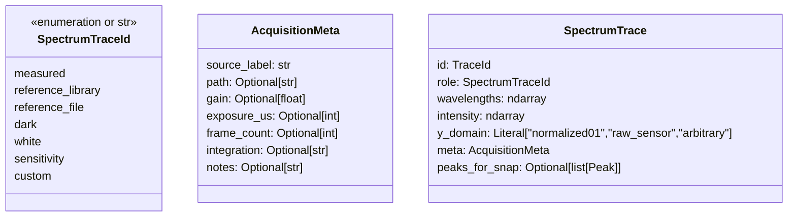
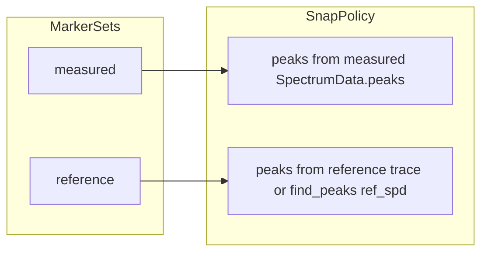

# Unified spectrum traces, markers, overlays, and metadata

This document responds to the need to **cut allocations**, **remove duplicated paths** (measured vs reference SPD, calibration assist markers, sensitivity overlay), and **carry rich, exportable metadata** for every trace—whether live capture, loaded reference file, or synthetic library SPD.

It complements [DISPLAY_GUI_ARCHITECTURE.md](DISPLAY_GUI_ARCHITECTURE.md) (composition and `DisplayManager`) and should be read together with [REFACTORING_GUIDE.md](REFACTORING_GUIDE.md).

---

## 1. Problems observed in the current code

### 1.1 Parallel representations

| Concern | Current pattern | Pain |
|--------|-------------------|------|
| **Measured vs reference** | Live data in `SpectrumData`; reference overlay in `DisplayState.reference_spectrum` + `reference_name` only | Reference has **no** `SpectrumData`-class capture metadata (gain, exposure, frame count, file path) unless you bolt it on elsewhere |
| **Calibration assist markers** | Two lists: `marker_lines` and `reference_marker_lines`, plus `calibration_assist_target` string and `set_calibration_reference_snap_peaks` | Same snapping/drag logic duplicated conceptually; mode code must **push** peaks for reference into a side channel |
| **Overlays** | `_mode_overlay`, `_raw_overlays`, `_sensitivity_overlay`, reference line in `_render_reference_spectrum` | Multiple code paths; **sensitivity** and **reference SPD** should both be “just another trace” with a style and Y semantics |
| **Scaling** | `scale_intensity_to_graph` (calibration preview), `render_polyline_overlay` with viewport (0–1 intensity), ad-hoc `y_axis_intensity` on `SpectrumData` | Easy to misalign Y scale between traces |

### 1.2 Allocation hotspots (concrete)

- **`display/overlay_utils.py`**: `render_polyline_overlay` builds a Python **`list` of points** then `np.array(points)`; `_render_with_viewport` does the same. Every frame this allocates heavily for long spectra.
- **`DisplayManager.render`**: frequent `np.vstack`, `copy()`, `cv2.resize` on the main loop (see [DISPLAY_GUI_ARCHITECTURE.md](DISPLAY_GUI_ARCHITECTURE.md) §2.3).
- **Peak lists for snap**: `find_peaks` → list of peak objects; acceptable if not per-frame, but reference snap peaks are **recomputed** when toggling assist (see `modes/calibration.py` `update_display`).

### 1.3 Sensitivity curve

- Documented assumption: intensity passed to `set_sensitivity_overlay` is **0–1 peak-normalised** (`get_curve_for_display`). If any caller passes graph-pixel coordinates or wrong length, the line looks wrong while **other** overlays use the same `render_polyline_overlay` path—so the bug is usually **contract drift**, not missing CV2 primitives.

---

## 2. Target model: one abstraction for “something plottable”

### 2.1 `SpectrumTrace` (domain)

A **trace** is not only an array; it is **data + role + acquisition context** for display and export.

**Rules**

- **`SpectrumData`** remains the **primary container for the live pipeline** (camera, peaks, cropped frames). It can embed or reference a `SpectrumTrace` for the **measured** line, or you add a thin **`to_trace()`** that fills `AcquisitionMeta` from `gain`, `exposure_us`, etc.
- **Library reference SPD** (Hg, D65, …): build a `SpectrumTrace` with `role=reference_library`, `meta.source_label` set, no file path.
- **Loaded reference file**: same trace type, `meta.path` and parsing info.
- **Sensitivity**: one trace with `role=sensitivity`, `y_domain` documented (e.g. peak-normalised 0–1 for overlay), `meta` describing sensor model / calibration version.

Export (CSV/PDF) iterates **traces** the user chose to include, not ad-hoc fields on `GraphExportRequest`.

### 2.2 `TraceLayer` (display)

For the graph, unify **what gets drawn**:

| Field | Purpose |
|-------|---------|
| `trace: SpectrumTrace` | Canonical Y values in the trace’s `y_domain` |
| `color` | BGR |
| `style` | `line` / `filled` / `dashed` |
| `use_viewport` | Same `Viewport` as measured |

A single function **`draw_trace_layers(graph, layers, viewport)`** replaces scattered `_render_mode_overlay` / `_render_raw_overlays` / `_render_sensitivity_overlay` / reference line—internally still calling **`render_polyline_overlay`** (or a faster sibling) once per visible layer.

**Calibration assist** no longer special-cases “reference vs measured” for drawing—only **which trace is active for editing** (see below).

---

## 3. Markers: `MarkerSet` + snap policy (no duplicate lists)

### 3.1 Problem

Two lists + `calibration_assist_target` duplicate **capacity limits**, **snap-to-peak**, and **drag** behavior.

### 3.2 Target

- **`MarkerSet`**: `id`, `indices: list[int]`, `max_markers=10`.
- **`MarkerController`**: owns both sets; **`active_set: MarkerSetId`** replaces string `calibration_assist_target`.
- **`resolve_snap_peaks(active, traces, data)`**: returns one list of `Peak` for snapping—**one implementation** used by mouse drag resolution.

`DisplayManager` delegates marker mouse handling to **`MarkerController`**; renderer receives **`active indices` + `wavelengths` + `intensity` for the trace that markers refer to** (measured always uses live `SpectrumData`; reference markers use reference trace resampled to same pixel grid as `data`).

This removes parallel `_peaks_for_marker_snap` / `set_calibration_reference_snap_peaks` if reference peaks are derived from the **reference `SpectrumTrace`** inside the controller when assist is on.

---

## 4. Allocations: what to change first

| Priority | Change | Effect |
|----------|--------|--------|
| **A** | Preallocate **`(max_width, 2)` int32 buffer** (or reuse two arrays) in `overlay_utils` and fill rows in C-order; pass to `cv2.polylines` without building Python lists | Large win on overlay-heavy frames |
| **B** | Replace `np.interp` temporaries with **preallocated scratch** when `resample_to_width` is fixed (sensor width) | Cuts alloc in viewport resample |
| **C** | Reuse **vertical stack buffer** in `DisplayManager` when dimensions unchanged | Cuts `vstack` alloc per frame |
| **D** | Document **when** `find_peaks` for reference assist may run (on toggle / source change, not every render) | Already mostly true; enforce in one place |

---

## 5. Metadata parity for export

Today **`SpectrumData`** already has `gain`, `exposure_us`, and CSV export preserves them (`csv_exporter.py`). Reference overlay is often **only** `np.ndarray` + short name on `DisplayState`.

**Target**

- Any trace that can appear on the graph or in a report is a **`SpectrumTrace`** with **`AcquisitionMeta`**.
- **PDF/CSV column headers** include optional metadata block (path, gain, exposure, averages) per trace.
- **Graph export** `GraphExportRequest`-style structs should accept **`list[SpectrumTrace]`** (or bundled `ExportBundle`) instead of separate `reference: ndarray` + `reference_name: str` only.

---

## 6. Phased migration (behavior-preserving steps)

1. **Introduce `SpectrumTrace` + `AcquisitionMeta`** in `core/` (no behavior change): add `SpectrumData.to_trace()` helper.
2. **Implement `draw_trace_layers`** that routes each layer to existing `render_polyline_overlay`; wire **sensitivity + reference + mode overlay** through it behind feature flag or single call site in `DisplayManager`.
3. **Replace dual peak storage** with `MarkerController` + two `MarkerSet`s; keep old `DisplayState` fields as deprecated properties delegating to controller until call sites updated.
4. **Overlay utils perf**: preallocated polyline buffer + tests for shape/parity.
5. **Export**: extend CSV/PDF to read metadata from `SpectrumTrace` for any exported reference row.

---

## 7. Relation to sensitivity “drawn wrong”

Treat sensitivity as **`SpectrumTrace(role=sensitivity)`** with explicit **`y_domain`**. Add a **unit test**: given flat 0–1 ramp and known viewport, output polyline vertices match golden screen coordinates. That catches **contract drift** between `get_curve_for_display` and overlay code.

---

## 8. Success criteria

- [ ] One API lists **all graph overlays** (measured fill, reference, raw overlays, sensitivity) for debugging.
- [ ] **Marker** add/drag/snap implemented once per **active set**, not forked by mode strings.
- [ ] **Export** can emit the same labels and numeric columns for **loaded reference** as for **live capture** when metadata is present.
- [ ] **Overlay hot path** avoids per-point Python list growth (buffer reuse verified by profiling or allocation counts).

---

*Last updated: 2026-03-31.*
