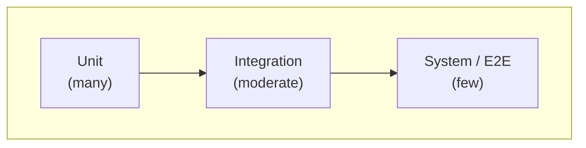

# PySpectrometer3 Testing Strategy

This document defines the testing strategy to keep code consistent and features solid. Reference: [ARCHITECTURE.md](ARCHITECTURE.md).

---

## 1. Principles

- **Algorithm correctness:** Use numpy/scipy to validate known algorithms. Tests must assert expected values, not just "does not crash."
- **Single responsibility:** Each test targets one behavior or invariant.
- **Determinism:** Use fixed seeds for random data; avoid flaky tests.
- **Isolation:** Mock hardware (camera, GPIO, I2C) so tests run without Pi hardware.
- **Fast feedback:** Unit tests run quickly; integration tests can be slower; system tests are optional/CI-only.

---

## 2. Test Pyramid



| Layer | Scope | Count | Hardware | Speed |
|-------|-------|-------|----------|-------|
| **Unit** | Single class/function, mocked deps | Many | None | Fast |
| **Integration** | Multiple modules, real pipelines | Moderate | None (synthetic data) | Medium |
| **System** | Full app, optional camera | Few | Optional | Slow |

---

## 3. What to Test

### 3.1 Spectrum Extraction (`processing/extraction.py`)

| Test | Type | Description |
|------|------|-------------|
| Horizontal spectrum (0°) | Unit | Extract intensity from synthetic horizontal slit; compare to known row. |
| Rotated spectrum (e.g. 10°) | Unit | Synthetic rotated slit; extracted spectrum aligns with expected after rotation correction. |
| Weighted sum vs median vs Gaussian | Unit | Same synthetic input; each method returns plausible 1D intensity; Gaussian fit converges. |
| Hot pixels | Unit | Synthetic spectrum with outliers; median robust, weighted sum affected. |
| Angle detection (Hough) | Unit | Synthetic rotated frame; `detect_angle` returns angle within tolerance. |

**Validation:** Compare extracted intensity to known reference (e.g. row sum, expected Gaussian amplitude). Use `numpy.allclose` or explicit error bounds.

### 3.2 Calibration (`core/calibration.py`, `modes/calibration.py`)

| Test | Type | Description |
|------|------|-------------|
| Pixel ↔ wavelength mapping | Unit | Given 4+ (pixel, λ) pairs, `recalibrate` yields monotonic wavelengths in visible range. |
| Polynomial fit (Snell-like) | Unit | Synthetic 3rd-order dispersion; recovered coeffs within tolerance. |
| Peak matching (Hg, FL12, LED, D65) | Integration | Synthetic spectrum from reference; `auto_calibrate` returns ≥4 points; max/mean error < threshold. |
| Correlation-based calibration | Integration | No peaks provided; correlation finds alignment; wavelength range sensible (360–780 nm). |
| Nonlinear CMOS response | Integration | Gamma-attenuated synthetic spectrum; calibration still recovers mapping within relaxed tolerance. |

**Existing:** `test_calibration.py`, `test_peak_detection.py` already cover many of these. Extend for FL12, LED, D65 if needed.

### 3.3 Processing Pipeline

| Test | Type | Description |
|------|------|-------------|
| Reference correction | Unit | `(Raw - Black) / (White - Black)`; synthetic Raw, Black, White; output matches expected. |
| Savitzky–Golay filter | Unit | Synthetic noisy spectrum; output smoother; compare to `scipy.signal.savgol_filter` if used. |
| Pipeline order | Integration | Add processors in sequence; run `SpectrumData`; assert each stage applied correctly. |

### 3.4 Modes

| Mode | Tests |
|------|-------|
| **Calibration** | Already covered by `test_calibration.py`. Add: FL12/LED/D65 reference sources if implemented. |
| **Measurement** | Unit: state transitions (frozen, averaging, refs). Integration: load spectrum as overlay/black/white; normalization formula. |
| **Waterfall** | Unit: waterfall buffer append, timestamp column in CSV. Integration: stream to file format. |
| **Raman** | Unit: `wavelength_to_wavenumber` matches formula; zero at laser λ. Integration: synthetic spectrum → Raman shift axis. |
| **Color Science** | Unit: XYZ/LAB from known spectrum vs scipy/numpy reference. Integration: swatch add/delete, ΔE between two colors. |

### 3.5 Data & I/O

| Component | Tests |
|-----------|-------|
| Reference spectra | Unit: `get_reference_spectrum(FL12, HG, LED, D65)` returns non-empty, sensible wavelength range. |
| CSV export | Unit: Export `SpectrumData`; parse CSV; wavelengths and intensity match. |
| Calibration load/save | Unit: Save (pixel, λ) pairs; load; `recalibrate` yields same mapping. |

### 3.6 Hardware Abstraction

| Component | Strategy |
|-----------|----------|
| Camera | Mock `CameraInterface`; return synthetic frames (e.g. gradient, Hg-like lines). |
| GPIO / I2C | Mock or skip; no real GPIO in CI. |

---

## 4. Synthetic Data & Fixtures

### 4.1 Shared Fixtures (`conftest.py` or `tests/fixtures/`)

- **`synthetic_frame_640x480`:** 2D array, horizontal or rotated slit.
- **`synthetic_hg_spectrum(n_pixels, wl, noise_std)`:** 1D intensity with Hg-like peaks + camera sensitivity + optional gamma.
- **`ground_truth_calibration(n_pixels)`:** Pixel → wavelength (polynomial, monotonic).
- **`synthetic_reference_spectrum(source, wavelengths)`:** Use `get_reference_spectrum` for FL12, HG, LED, D65.

### 4.2 Random Seeds

Use `np.random.default_rng(42)` (or fixed seed) for reproducibility. Document seeds in test docstrings.

### 4.3 Real Data (Optional)

- `data/Spectrum-*.csv`: Real Hg lamp spectrum for integration tests. Skip if file missing (`pytest.skip`).
- Keep a small set of "golden" spectra for regression.

---

## 5. Algorithm Validation (numpy/scipy)

For any algorithm with a known mathematical definition:

1. **Implement test:** Compute expected result using numpy/scipy directly.
2. **Compare:** Assert `np.allclose(actual, expected, rtol=..., atol=...)` or explicit error bounds.
3. **Document:** Reference formula (e.g. Raman shift, CIE XYZ) in test docstring.

Examples:

- **Raman wavenumber:** `(1/λ_laser - 1/λ) * 1e7` — verify with known λ pairs.
- **XYZ tristimulus:** Compare to `colour-science` or hand-computed values for D65.
- **Polynomial fit:** `np.polyfit` + `np.poly1d` — calibration should match within tolerance.

---

## 6. Running Tests

```bash
# All tests (from project root)
make test

# Or directly
cd src && python3 -m pytest pyspectrometer -v

# With coverage
cd src && python3 -m pytest pyspectrometer -v --cov=pyspectrometer --cov-report=term-missing

# Single file
cd src && python3 -m pytest pyspectrometer/tests/test_calibration.py -v

# Single test
cd src && python3 -m pytest pyspectrometer/tests/test_calibration.py::test_calibration_recovers_hg_wavelength_mapping -v
```

---

## 7. CI / Pre-commit

- **Run on every push/PR:** `make test` (or `pytest` with `|| exit 1` so failures fail CI).
- **Lint:** `make lint` (flake8).
- **Type check:** `make typecheck` (mypy) if configured.
- **Coverage:** Aim for ≥80% on core modules (calibration, extraction, processing pipeline). Exclude GUI, display, `__main__` if needed.

---

## 8. Coverage Goals

| Module | Target | Notes |
|--------|--------|-------|
| `core/calibration.py` | ≥90% | Critical path |
| `processing/extraction.py` | ≥85% | Algorithm correctness |
| `processing/peak_detection.py` | ≥85% | Already tested |
| `processing/reference_correction.py` | ≥80% | Straightforward |
| `modes/calibration.py` | ≥70% | Integration-heavy |
| `modes/measurement.py` | ≥60% | State + integration |
| `data/reference_spectra.py` | ≥80% | Data loading |

---

## 9. Test Naming & Structure

- **File:** `test_<module>.py` (e.g. `test_extraction.py`, `test_raman.py`).
- **Function:** `test_<behavior>_<condition>` (e.g. `test_weighted_sum_extracts_horizontal_slit`, `test_raman_zero_at_laser_wavelength`).
- **Docstring:** One-line description; reference formula/tolerance if applicable.

---

## 10. Checklist for New Features

Before merging:

1. [ ] Unit tests for new logic.
2. [ ] Integration test if multiple modules interact.
3. [ ] Algorithm validation with numpy/scipy where applicable.
4. [ ] No new flaky tests (fixed seeds, no time-dependent logic).
5. [ ] `make test` passes.
6. [ ] Coverage does not decrease on modified modules.

---

This strategy keeps the codebase consistent, validates algorithms against known references, and ensures features remain solid as the project evolves.
