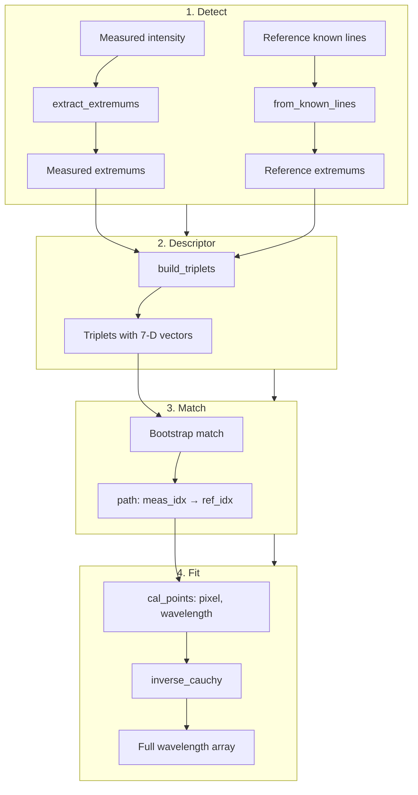
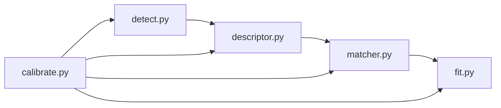

# Calibration: Matching and Fitting Algorithm

This document describes the triplet-based matching and inverse Cauchy fitting used for spectrometer wavelength calibration.

## Overview



## 1. Extremum Detection

**Source:** `pyspectrometer.processing.peak_detection.extract_extremums`  
**Wrapper:** `calibration_srp.detect.extract`

- Find all peaks (local maxima) and dips (local minima) via `scipy.signal.find_peaks`
- Peaks: prominence 0.5% of range, min distance 8 samples
- Dips: prominence 2.5% of range, min distance 15 samples
- For each extremum, compute:
  - **Height:** `max(left_baseline_to_apex, right_baseline_to_apex)`
  - **Width:** `2 × min(left_half, right_half)` in nm at 1/e rel height
- Concatenate peaks and dips, sort by `abs(height)` descending, take top N (default 20)
- Reference uses known spectral lines (`from_known_lines`) instead of detection

## 2. Triplet Descriptors

**Source:** `calibration_srp.descriptor`

Each triplet is (left, center, right) with a 7-D descriptor:

| Index | Label   | Meaning                                      |
|-------|---------|----------------------------------------------|
| 0     | height  | Center extremum height (signed: peak +, dip −) |
| 1     | width   | Center width in nm                           |
| 2     | A-h/h   | Left height / center height                  |
| 3     | B-h/h   | Right height / center height                 |
| 4     | A-w/w   | Left width / center width                   |
| 5     | B-w/w   | Right width / center width                  |
| 6     | rel_pos | (center_pos − left_pos) / (right_pos − left_pos) |

**Triplet construction:** For center index `c`, left = immediate left (`c−1`), right = each peak to the right (`c+1` … `n−1`). This yields multiple triplets per center.

**Weights:** `[1, 1, 1, 1, 1, 1, 2.5]` — `rel_pos` weighted higher to favor similar relative position within span.

## 3. Bootstrap Matching

**Source:** `calibration_srp.matcher`


**Algorithm:**

1. **Seed candidates:** For each (measured_idx, ref_idx) with same type (peak/peak or dip/dip), compute `best_pair_score` over all triplet pairs for that center pair. Sort by score, take top `n_seeds` (default 5).
2. **Bootstrap from seed:** Start with one (meas, ref) pair. Repeatedly:
   - Extend left: find (meas, ref) with smaller pixel and smaller wavelength that does not cross existing path
   - Extend right: find (meas, ref) with larger pixel and larger wavelength that does not cross
   - Stop when no extension possible
3. **Crossing check:** Path must be monotonic: when sorted by pixel, reference wavelengths must strictly increase.
4. **Best path:** Prefer longest path; tie-break by total triplet score + 0.05 × path length.

**Scoring metrics:**
- Euclidean: `1 / (1 + ||w·va − w·vb||)`
- Cosine: `(cos(w·va, w·vb) + 1) / 2`

Both metrics are run; the path with more points wins.

## 4. Inverse Cauchy Fit

**Source:** `calibration_srp.fit`

Prism dispersion is modeled as inverse Cauchy: wavelength vs pixel follows `1/λ² ≈ poly(pixel)`.

```mermaid
flowchart TD
    A[cal_points: pixel, wavelength] --> B[Sort by pixel]
    B --> C[inv_wl² = 1 / (wl/1000)²]
    C --> D[Polyfit px → inv_wl², deg=min2,len-1]
    D --> E[Evaluate poly on 0..n_pixels-1]
    E --> F[wl = 1000 / sqrt pred_inv]
    F --> G{Monotonic?}
    G -->|Yes| H[Return wavelength array]
    G -->|No| I[PCHIP or linear fallback]
    I --> H
```

**Steps:**
1. Convert (pixel, wavelength) to (pixel, 1/λ²) with λ in µm
2. Fit polynomial of degree ≤ 2
3. Evaluate on full pixel grid, convert back to nm
4. If result is not strictly monotonic, fall back to PCHIP (or linear) interpolation

## 5. Fallback

When triplet matching yields &lt;4 cal points, the system falls back to hypothesis-based peak matching (`calibrate_peaks`): sequential hypotheses with tolerance, scored by alignment quality.

## Module Layout


